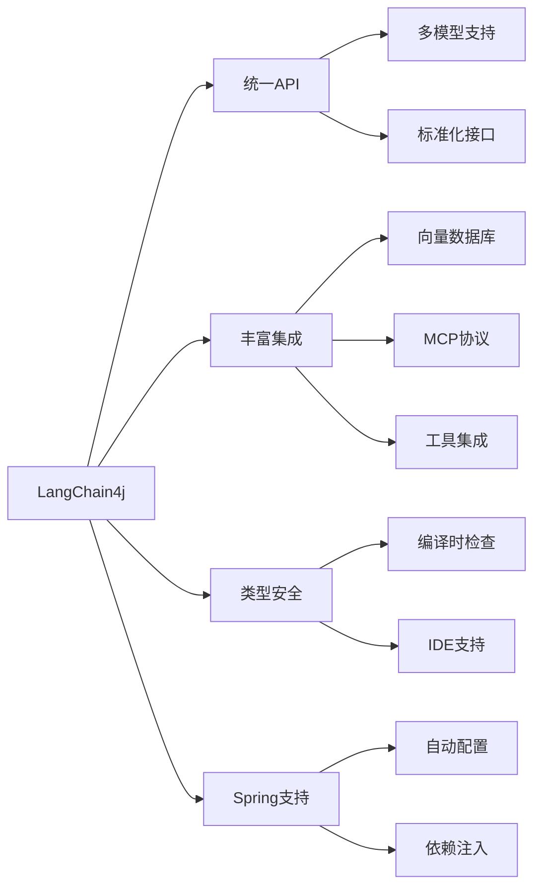

# LangChain4j MCP Client 基础入门

> **LangChain4j MCP 系列第一篇** - 深入理解 LangChain4j 框架中的 MCP Client 实现原理与基础应用

## 📋 目录

- [LangChain4j 框架概述](#langchain4j-框架概述)
- [MCP Client 核心概念](#mcp-client-核心概念)
- [传输层实现详解](#传输层实现详解)
- [基础开发实战](#基础开发实战)
- [与 AI 模型集成](#与-ai-模型集成)
- [最佳实践与注意事项](#最佳实践与注意事项)

## 🚀 LangChain4j 框架概述

### 什么是 LangChain4j

LangChain4j 是 LangChain 的 Java 实现版本，专为 Java 生态系统设计的 AI 应用开发框架。它提供了统一的 API 来集成各种大语言模型（LLM）、向量数据库、工具和服务。

### 核心优势



### 架构特点

- **🔌 插件化设计**: 支持多种 LLM 提供商
- **🛠️ 工具集成**: 内置 MCP 协议支持
- **📊 向量化支持**: 集成主流向量数据库
- **🌱 Spring 友好**: 完整的 Spring Boot 集成

## 🔧 MCP Client 核心概念

### LangChain4j 中的 MCP 架构

```java
// LangChain4j MCP 核心接口
public interface McpClient {
    // 初始化连接
    CompletableFuture<Void> initialize();
    
    // 列出可用工具
    CompletableFuture<List<Tool>> listTools();
    
    // 执行工具
    CompletableFuture<ToolExecutionResult> executeTool(ToolExecutionRequest request);
    
    // 列出资源
    CompletableFuture<List<Resource>> listResources();
    
    // 读取资源
    CompletableFuture<ResourceContent> readResource(String uri);
    
    // 关闭连接
    CompletableFuture<Void> close();
}
```

### 核心组件解析

#### 1. DefaultMcpClient

```java
public class DefaultMcpClient implements McpClient {
    private final String clientName;
    private final String protocolVersion;
    private final Duration toolExecutionTimeout;
    private final McpTransport transport;
    
    // 构建器模式
    public static class Builder {
        public Builder clientName(String clientName) {
            this.clientName = clientName;
            return this;
        }
        
        public Builder protocolVersion(String version) {
            this.protocolVersion = version;
            return this;
        }
        
        public Builder toolExecutionTimeout(Duration timeout) {
            this.toolExecutionTimeout = timeout;
            return this;
        }
        
        public Builder transport(McpTransport transport) {
            this.transport = transport;
            return this;
        }
        
        public McpClient build() {
            return new DefaultMcpClient(this);
        }
    }
}
```

#### 2. 传输层抽象

```java
public interface McpTransport {
    // 发送消息
    CompletableFuture<String> send(String message);
    
    // 接收消息
    void onMessage(Consumer<String> messageHandler);
    
    // 关闭传输
    CompletableFuture<Void> close();
    
    // 检查连接状态
    boolean isConnected();
}
```

## 🌐 传输层实现详解

### STDIO 传输实现

STDIO 传输适用于本地 MCP 服务器，通过标准输入输出与子进程通信。

```java
public class StdioMcpTransport implements McpTransport {
    private final List<String> command;
    private final boolean logEvents;
    private Process process;
    private BufferedWriter writer;
    private BufferedReader reader;
    
    public static class Builder {
        private List<String> command;
        private boolean logEvents = false;
        
        public Builder command(List<String> command) {
            this.command = command;
            return this;
        }
        
        public Builder logEvents(boolean logEvents) {
            this.logEvents = logEvents;
            return this;
        }
        
        public StdioMcpTransport build() {
            return new StdioMcpTransport(this);
        }
    }
    
    @Override
    public CompletableFuture<String> send(String message) {
        return CompletableFuture.runAsync(() -> {
            try {
                writer.write(message);
                writer.newLine();
                writer.flush();
                
                if (logEvents) {
                    logger.debug("Sent: {}", message);
                }
            } catch (IOException e) {
                throw new RuntimeException("Failed to send message", e);
            }
        });
    }
    
    private void startProcess() throws IOException {
        ProcessBuilder pb = new ProcessBuilder(command);
        pb.redirectErrorStream(true);
        
        process = pb.start();
        writer = new BufferedWriter(new OutputStreamWriter(process.getOutputStream()));
        reader = new BufferedReader(new InputStreamReader(process.getInputStream()));
        
        // 启动消息读取线程
        startMessageReader();
    }
}
```

### HTTP/SSE 传输实现

HTTP/SSE 传输适用于远程 MCP 服务器，通过 Server-Sent Events 进行通信。

```java
public class HttpMcpTransport implements McpTransport {
    private final String sseUrl;
    private final Duration timeout;
    private final boolean logRequests;
    private final boolean logResponses;
    private OkHttpClient httpClient;
    private EventSource eventSource;
    
    public static class Builder {
        private String sseUrl;
        private Duration timeout = Duration.ofSeconds(60);
        private boolean logRequests = false;
        private boolean logResponses = false;
        
        public Builder sseUrl(String sseUrl) {
            this.sseUrl = sseUrl;
            return this;
        }
        
        public Builder timeout(Duration timeout) {
            this.timeout = timeout;
            return this;
        }
        
        public Builder logRequests(boolean logRequests) {
            this.logRequests = logRequests;
            return this;
        }
        
        public Builder logResponses(boolean logResponses) {
            this.logResponses = logResponses;
            return this;
        }
        
        public HttpMcpTransport build() {
            return new HttpMcpTransport(this);
        }
    }
    
    @Override
    public CompletableFuture<String> send(String message) {
        RequestBody body = RequestBody.create(message, MediaType.get("application/json"));
        Request request = new Request.Builder()
            .url(sseUrl)
            .post(body)
            .build();
            
        if (logRequests) {
            logger.debug("Request: {}", message);
        }
        
        return CompletableFuture.supplyAsync(() -> {
            try (Response response = httpClient.newCall(request).execute()) {
                String responseBody = response.body().string();
                
                if (logResponses) {
                    logger.debug("Response: {}", responseBody);
                }
                
                return responseBody;
            } catch (IOException e) {
                throw new RuntimeException("HTTP request failed", e);
            }
        });
    }
}
```

## 💻 基础开发实战

### 项目依赖配置

```xml
<dependencies>
    <!-- LangChain4j 核心 -->
    <dependency>
        <groupId>dev.langchain4j</groupId>
        <artifactId>langchain4j</artifactId>
        <version>0.35.0</version>
    </dependency>
    
    <!-- LangChain4j MCP 支持 -->
    <dependency>
        <groupId>dev.langchain4j</groupId>
        <artifactId>langchain4j-mcp</artifactId>
        <version>0.35.0</version>
    </dependency>
    
    <!-- Spring Boot 集成 -->
    <dependency>
        <groupId>dev.langchain4j</groupId>
        <artifactId>langchain4j-spring-boot-starter</artifactId>
        <version>0.35.0</version>
    </dependency>
    
    <!-- 模型提供商（示例：OpenAI） -->
    <dependency>
        <groupId>dev.langchain4j</groupId>
        <artifactId>langchain4j-open-ai</artifactId>
        <version>0.35.0</version>
    </dependency>
</dependencies>
```

### 基础 MCP Client 实现

```java
@Component
public class BasicMcpClientExample {
    private static final Logger logger = LoggerFactory.getLogger(BasicMcpClientExample.class);
    
    // STDIO 客户端示例
    public McpClient createStdioClient() {
        return new DefaultMcpClient.Builder()
            .clientName("basic-mcp-client")
            .protocolVersion("2024-11-05")
            .toolExecutionTimeout(Duration.ofSeconds(30))
            .transport(new StdioMcpTransport.Builder()
                .command(Arrays.asList("npx", "-y", "kubernetes-mcp-server@latest"))
                .logEvents(true)
                .build())
            .build();
    }
    
    // HTTP/SSE 客户端示例
    public McpClient createHttpClient(String sseUrl) {
        return new DefaultMcpClient.Builder()
            .clientName("basic-mcp-client")
            .protocolVersion("2024-11-05")
            .toolExecutionTimeout(Duration.ofSeconds(30))
            .transport(new HttpMcpTransport.Builder()
                .sseUrl(sseUrl)
                .timeout(Duration.ofSeconds(10))
                .logRequests(true)
                .logResponses(true)
                .build())
            .build();
    }
    
    // 基础使用示例
    public void basicUsageExample() {
        McpClient client = createStdioClient();
        
        try {
            // 初始化连接
            client.initialize().get();
            logger.info("MCP Client initialized successfully");
            
            // 列出可用工具
            List<Tool> tools = client.listTools().get();
            logger.info("Available tools: {}", tools.size());
            
            tools.forEach(tool -> {
                logger.info("Tool: {} - {}", tool.getName(), tool.getDescription());
            });
            
            // 执行工具（示例）
            if (!tools.isEmpty()) {
                Tool firstTool = tools.get(0);
                ToolExecutionRequest request = ToolExecutionRequest.builder()
                    .name(firstTool.getName())
                    .arguments("{}")
                    .build();
                    
                ToolExecutionResult result = client.executeTool(request).get();
                logger.info("Tool execution result: {}", result.getContent());
            }
            
        } catch (Exception e) {
            logger.error("Error during MCP client operation", e);
        } finally {
            try {
                client.close().get();
            } catch (Exception e) {
                logger.error("Error closing MCP client", e);
            }
        }
    }
}
```

### 配置化客户端管理

```java
@Configuration
@EnableConfigurationProperties(McpClientProperties.class)
public class McpClientConfiguration {
    
    @Bean
    @ConditionalOnProperty(name = "mcp.client.enabled", havingValue = "true")
    public McpClient mcpClient(McpClientProperties properties) {
        DefaultMcpClient.Builder builder = new DefaultMcpClient.Builder()
            .clientName(properties.getClientName())
            .protocolVersion(properties.getProtocolVersion())
            .toolExecutionTimeout(properties.getToolExecutionTimeout());
            
        // 根据配置选择传输方式
        if (properties.getTransport().getType() == TransportType.STDIO) {
            builder.transport(createStdioTransport(properties.getTransport().getStdio()));
        } else if (properties.getTransport().getType() == TransportType.HTTP) {
            builder.transport(createHttpTransport(properties.getTransport().getHttp()));
        }
        
        return builder.build();
    }
    
    private StdioMcpTransport createStdioTransport(StdioTransportProperties stdio) {
        return new StdioMcpTransport.Builder()
            .command(stdio.getCommand())
            .logEvents(stdio.isLogEvents())
            .build();
    }
    
    private HttpMcpTransport createHttpTransport(HttpTransportProperties http) {
        return new HttpMcpTransport.Builder()
            .sseUrl(http.getSseUrl())
            .timeout(http.getTimeout())
            .logRequests(http.isLogRequests())
            .logResponses(http.isLogResponses())
            .build();
    }
}

// 配置属性类
@ConfigurationProperties(prefix = "mcp.client")
@Data
public class McpClientProperties {
    private boolean enabled = false;
    private String clientName = "langchain4j-mcp-client";
    private String protocolVersion = "2024-11-05";
    private Duration toolExecutionTimeout = Duration.ofSeconds(60);
    private TransportProperties transport = new TransportProperties();
    
    @Data
    public static class TransportProperties {
        private TransportType type = TransportType.STDIO;
        private StdioTransportProperties stdio = new StdioTransportProperties();
        private HttpTransportProperties http = new HttpTransportProperties();
    }
    
    @Data
    public static class StdioTransportProperties {
        private List<String> command = Arrays.asList("echo", "MCP Server");
        private boolean logEvents = false;
    }
    
    @Data
    public static class HttpTransportProperties {
        private String sseUrl;
        private Duration timeout = Duration.ofSeconds(60);
        private boolean logRequests = false;
        private boolean logResponses = false;
    }
    
    public enum TransportType {
        STDIO, HTTP
    }
}
```

## 🤖 与 AI 模型集成

### AI 服务集成

LangChain4j 的强大之处在于能够轻松地将 MCP 工具与 AI 模型集成。

```java
@Service
public class McpAiAssistantService {
    
    // 定义 AI 助手接口
    public interface McpAssistant {
        String chat(String userMessage);
    }
    
    @Autowired
    private McpClient mcpClient;
    
    public McpAssistant createAssistant() {
        return AiServices.builder(McpAssistant.class)
            // 配置聊天模型
            .chatModel(OpenAiChatModel.builder()
                .apiKey(System.getenv("OPENAI_API_KEY"))
                .modelName("gpt-4")
                .temperature(0.7)
                .build())
            // 集成 MCP 工具提供者
            .toolProvider(McpToolProvider.builder()
                .mcpClients(mcpClient)
                .build())
            // 配置系统消息
            .systemMessage("你是一个智能助手，可以使用各种工具来帮助用户完成任务。")
            .build();
    }
    
    // 使用示例
    public void demonstrateAssistant() {
        McpAssistant assistant = createAssistant();
        
        // 与助手对话
        String response1 = assistant.chat("请帮我列出当前 Kubernetes 集群中的所有 Pod");
        System.out.println("助手回复: " + response1);
        
        String response2 = assistant.chat("创建一个名为 'test-app' 的 Pod，使用 nginx 镜像");
        System.out.println("助手回复: " + response2);
    }
}
```

### 高级 AI 服务配置

```java
@Configuration
public class AdvancedAiServiceConfiguration {
    
    @Bean
    public McpAssistant advancedMcpAssistant(
            McpClient mcpClient,
            ChatModel chatModel,
            ChatMemory chatMemory) {
        
        return AiServices.builder(McpAssistant.class)
            .chatModel(chatModel)
            .chatMemory(chatMemory)
            .toolProvider(McpToolProvider.builder()
                .mcpClients(mcpClient)
                .build())
            // 添加消息预处理器
            .chatMemoryProvider(memoryId -> chatMemory)
            // 添加工具执行监听器
            .toolExecutionListener(new ToolExecutionListener() {
                @Override
                public void onToolExecutionStart(ToolExecutionStartEvent event) {
                    logger.info("开始执行工具: {}", event.getToolName());
                }
                
                @Override
                public void onToolExecutionFinish(ToolExecutionFinishEvent event) {
                    logger.info("工具执行完成: {}, 耗时: {}ms", 
                        event.getToolName(), event.getDuration().toMillis());
                }
            })
            .build();
    }
    
    @Bean
    public ChatMemory chatMemory() {
        return MessageWindowChatMemory.withMaxMessages(10);
    }
}
```

### 流式响应处理

```java
@Service
public class StreamingMcpService {
    
    public interface StreamingMcpAssistant {
        TokenStream chat(String userMessage);
    }
    
    public StreamingMcpAssistant createStreamingAssistant(McpClient mcpClient) {
        return AiServices.builder(StreamingMcpAssistant.class)
            .streamingChatModel(OpenAiStreamingChatModel.builder()
                .apiKey(System.getenv("OPENAI_API_KEY"))
                .modelName("gpt-4")
                .build())
            .toolProvider(McpToolProvider.builder()
                .mcpClients(mcpClient)
                .build())
            .build();
    }
    
    public void demonstrateStreaming(McpClient mcpClient) {
        StreamingMcpAssistant assistant = createStreamingAssistant(mcpClient);
        
        assistant.chat("分析当前系统状态并提供优化建议")
            .onNext(System.out::print)
            .onComplete(response -> System.out.println("\n流式响应完成"))
            .onError(Throwable::printStackTrace)
            .start();
    }
}
```

## 📚 最佳实践与注意事项

### 1. 资源管理

```java
@Component
public class McpClientManager {
    private final Map<String, McpClient> clients = new ConcurrentHashMap<>();
    
    @PostConstruct
    public void initializeClients() {
        // 初始化多个客户端
    }
    
    @PreDestroy
    public void cleanup() {
        clients.values().forEach(client -> {
            try {
                client.close().get(5, TimeUnit.SECONDS);
            } catch (Exception e) {
                logger.warn("Failed to close MCP client", e);
            }
        });
    }
}
```

### 2. 错误处理

```java
public class RobustMcpClient {
    
    public CompletableFuture<ToolExecutionResult> executeToolWithRetry(
            McpClient client, ToolExecutionRequest request) {
        
        return CompletableFuture.supplyAsync(() -> {
            int maxRetries = 3;
            Exception lastException = null;
            
            for (int i = 0; i < maxRetries; i++) {
                try {
                    return client.executeTool(request).get();
                } catch (Exception e) {
                    lastException = e;
                    logger.warn("Tool execution failed, attempt {}/{}", i + 1, maxRetries, e);
                    
                    if (i < maxRetries - 1) {
                        try {
                            Thread.sleep(1000 * (i + 1)); // 指数退避
                        } catch (InterruptedException ie) {
                            Thread.currentThread().interrupt();
                            break;
                        }
                    }
                }
            }
            
            throw new RuntimeException("Tool execution failed after " + maxRetries + " attempts", lastException);
        });
    }
}
```

### 3. 性能监控

```java
@Component
public class McpClientMetrics {
    private final MeterRegistry meterRegistry;
    private final Timer toolExecutionTimer;
    private final Counter toolExecutionCounter;
    
    public McpClientMetrics(MeterRegistry meterRegistry) {
        this.meterRegistry = meterRegistry;
        this.toolExecutionTimer = Timer.builder("mcp.tool.execution.duration")
            .description("Tool execution duration")
            .register(meterRegistry);
        this.toolExecutionCounter = Counter.builder("mcp.tool.execution.total")
            .description("Total tool executions")
            .register(meterRegistry);
    }
    
    public <T> T measureToolExecution(String toolName, Supplier<T> operation) {
        return toolExecutionTimer.recordCallable(() -> {
            toolExecutionCounter.increment(Tags.of("tool", toolName));
            return operation.get();
        });
    }
}
```

## 🎯 下一步学习

在掌握了 LangChain4j MCP Client 的基础知识后，建议继续学习：

1. **[第二篇：LangChain4j MCP 高级特性与工具开发](02-langchain4j-mcp-advanced.md)**
2. **[第三篇：LangChain4j MCP 生产环境实践](03-langchain4j-mcp-production.md)**
3. **[第四篇：LangChain4j MCP 性能优化与监控](04-langchain4j-mcp-performance.md)**

## 📚 参考资源

- [LangChain4j 官方文档](https://docs.langchain4j.dev/)
- [LangChain4j GitHub 仓库](https://github.com/langchain4j/langchain4j)
- [MCP 协议规范](https://spec.modelcontextprotocol.io/)
- [LangChain4j 示例项目](https://github.com/langchain4j/langchain4j-examples)

