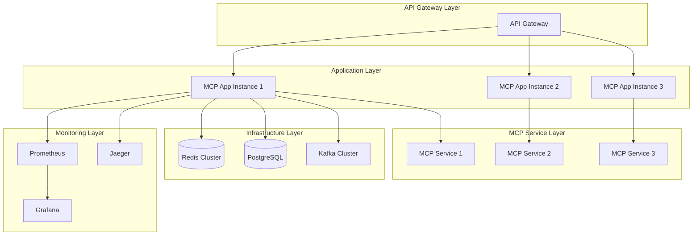

# LangChain4j MCP 生产环境实践

> **LangChain4j MCP 系列第三篇** - 生产级 LangChain4j MCP 应用的部署、监控、安全和运维最佳实践

## 📋 目录

- [生产环境架构设计](#生产环境架构设计)
- [容器化与编排](#容器化与编排)
- [配置管理与安全](#配置管理与安全)
- [监控与可观测性](#监控与可观测性)
- [性能调优策略](#性能调优策略)
- [故障处理与恢复](#故障处理与恢复)

## 🏗️ 生产环境架构设计

### 微服务架构模式



### 生产级应用配置

```java
@Configuration
@Profile("production")
public class ProductionMcpConfiguration {
    
    @Bean
    @Primary
    public McpClientPool productionMcpClientPool(
            @Value("${mcp.pool.min-size:5}") int minSize,
            @Value("${mcp.pool.max-size:50}") int maxSize,
            @Value("${mcp.pool.max-wait:30s}") Duration maxWait) {
        
        return McpClientPool.builder()
            .minSize(minSize)
            .maxSize(maxSize)
            .maxWait(maxWait)
            .healthCheckInterval(Duration.ofSeconds(30))
            .idleTimeout(Duration.ofMinutes(10))
            .validationQuery("ping")
            .build();
    }
    
    @Bean
    public McpLoadBalancer loadBalancer() {
        return McpLoadBalancer.builder()
            .strategy(LoadBalancingStrategy.WEIGHTED_ROUND_ROBIN)
            .healthCheckEnabled(true)
            .failoverEnabled(true)
            .circuitBreakerEnabled(true)
            .build();
    }
    
    @Bean
    public McpSecurityManager securityManager() {
        return McpSecurityManager.builder()
            .authenticationEnabled(true)
            .authorizationEnabled(true)
            .rateLimitingEnabled(true)
            .auditLoggingEnabled(true)
            .encryptionEnabled(true)
            .build();
    }
    
    @Bean
    public McpMonitoringManager monitoringManager(
            MeterRegistry meterRegistry,
            TracingContext tracingContext) {
        
        return McpMonitoringManager.builder()
            .meterRegistry(meterRegistry)
            .tracingContext(tracingContext)
            .metricsEnabled(true)
            .tracingEnabled(true)
            .loggingEnabled(true)
            .alertingEnabled(true)
            .build();
    }
}
```

### 高可用部署策略

```java
@Component
public class HighAvailabilityMcpService {
    private final List<McpClient> primaryClients;
    private final List<McpClient> secondaryClients;
    private final FailoverManager failoverManager;
    private final HealthChecker healthChecker;
    
    public CompletableFuture<ToolExecutionResult> executeWithHA(
            ToolExecutionRequest request) {
        
        // 1. 尝试主要客户端
        return executeOnClients(primaryClients, request)
            .exceptionallyCompose(primaryFailure -> {
                logger.warn("Primary clients failed, failing over to secondary", primaryFailure);
                
                // 2. 故障转移到备用客户端
                return executeOnClients(secondaryClients, request)
                    .exceptionallyCompose(secondaryFailure -> {
                        logger.error("Both primary and secondary clients failed", secondaryFailure);
                        
                        // 3. 启动紧急恢复流程
                        return emergencyRecovery(request);
                    });
            });
    }
    
    private CompletableFuture<ToolExecutionResult> executeOnClients(
            List<McpClient> clients, ToolExecutionRequest request) {
        
        List<McpClient> healthyClients = clients.stream()
            .filter(healthChecker::isHealthy)
            .collect(Collectors.toList());
            
        if (healthyClients.isEmpty()) {
            return CompletableFuture.failedFuture(
                new RuntimeException("No healthy clients available"));
        }
        
        // 使用第一个健康的客户端
        McpClient selectedClient = healthyClients.get(0);
        
        return selectedClient.executeTool(request)
            .orTimeout(30, TimeUnit.SECONDS);
    }
    
    private CompletableFuture<ToolExecutionResult> emergencyRecovery(
            ToolExecutionRequest request) {
        
        // 1. 记录紧急情况
        alertManager.sendCriticalAlert("MCP service emergency recovery triggered");
        
        // 2. 尝试创建临时客户端
        try {
            McpClient emergencyClient = createEmergencyClient();
            return emergencyClient.executeTool(request);
        } catch (Exception e) {
            // 3. 返回降级响应
            return CompletableFuture.completedFuture(
                createDegradedResponse("Service temporarily unavailable"));
        }
    }
    
    @Scheduled(fixedRate = 30000) // 每30秒检查一次
    public void performHealthChecks() {
        checkAndUpdateClientHealth(primaryClients, "primary");
        checkAndUpdateClientHealth(secondaryClients, "secondary");
        
        // 自动恢复不健康的客户端
        attemptClientRecovery();
    }
}
```

## 🐳 容器化与编排

### Dockerfile 优化

```dockerfile
# 多阶段构建
FROM openjdk:17-jdk-slim as builder

WORKDIR /app

# 复制依赖文件
COPY pom.xml .
COPY .mvn .mvn
COPY mvnw .

# 下载依赖（利用 Docker 缓存）
RUN ./mvnw dependency:go-offline -B

# 复制源代码
COPY src ./src

# 构建应用
RUN ./mvnw clean package -DskipTests

# 运行时镜像
FROM openjdk:17-jre-slim

# 创建非 root 用户
RUN groupadd -r mcpuser && useradd -r -g mcpuser mcpuser

# 安装必要工具
RUN apt-get update && apt-get install -y \
    curl \
    jq \
    netcat-openbsd \
    && rm -rf /var/lib/apt/lists/*

# 设置工作目录
WORKDIR /app

# 复制应用文件
COPY --from=builder /app/target/*.jar app.jar
COPY --chown=mcpuser:mcpuser scripts/ ./scripts/
COPY --chown=mcpuser:mcpuser config/ ./config/

# 创建日志目录
RUN mkdir -p /var/log/mcp && chown mcpuser:mcpuser /var/log/mcp

# JVM 优化参数
ENV JAVA_OPTS="-Xms2g -Xmx4g \
    -XX:+UseG1GC \
    -XX:MaxGCPauseMillis=200 \
    -XX:+HeapDumpOnOutOfMemoryError \
    -XX:HeapDumpPath=/var/log/mcp/ \
    -Djava.security.egd=file:/dev/./urandom"

# 健康检查
HEALTHCHECK --interval=30s --timeout=10s --start-period=60s --retries=3 \
    CMD curl -f http://localhost:8080/actuator/health || exit 1

# 切换到非 root 用户
USER mcpuser

EXPOSE 8080

ENTRYPOINT ["sh", "-c", "java $JAVA_OPTS -jar app.jar"]
```

### Kubernetes 部署配置

```yaml
# deployment.yaml
apiVersion: apps/v1
kind: Deployment
metadata:
  name: langchain4j-mcp-app
  labels:
    app: langchain4j-mcp
    version: v1.0.0
spec:
  replicas: 3
  strategy:
    type: RollingUpdate
    rollingUpdate:
      maxSurge: 1
      maxUnavailable: 0
  selector:
    matchLabels:
      app: langchain4j-mcp
  template:
    metadata:
      labels:
        app: langchain4j-mcp
        version: v1.0.0
      annotations:
        prometheus.io/scrape: "true"
        prometheus.io/port: "8080"
        prometheus.io/path: "/actuator/prometheus"
    spec:
      serviceAccountName: langchain4j-mcp
      securityContext:
        runAsNonRoot: true
        runAsUser: 1000
        fsGroup: 1000
      containers:
      - name: langchain4j-mcp
        image: langchain4j-mcp:v1.0.0
        ports:
        - containerPort: 8080
          name: http
        env:
        - name: SPRING_PROFILES_ACTIVE
          value: "production,kubernetes"
        - name: OPENAI_API_KEY
          valueFrom:
            secretKeyRef:
              name: ai-secrets
              key: openai-api-key
        - name: MCP_REDIS_PASSWORD
          valueFrom:
            secretKeyRef:
              name: redis-secret
              key: password
        resources:
          requests:
            memory: "2Gi"
            cpu: "500m"
          limits:
            memory: "4Gi"
            cpu: "2000m"
        livenessProbe:
          httpGet:
            path: /actuator/health/liveness
            port: 8080
          initialDelaySeconds: 60
          periodSeconds: 30
          timeoutSeconds: 10
          failureThreshold: 3
        readinessProbe:
          httpGet:
            path: /actuator/health/readiness
            port: 8080
          initialDelaySeconds: 30
          periodSeconds: 10
          timeoutSeconds: 5
          failureThreshold: 3
        volumeMounts:
        - name: config
          mountPath: /app/config
          readOnly: true
        - name: logs
          mountPath: /var/log/mcp
      volumes:
      - name: config
        configMap:
          name: langchain4j-mcp-config
      - name: logs
        emptyDir: {}

---
# service.yaml
apiVersion: v1
kind: Service
metadata:
  name: langchain4j-mcp-service
  labels:
    app: langchain4j-mcp
spec:
  selector:
    app: langchain4j-mcp
  ports:
  - port: 80
    targetPort: 8080
    protocol: TCP
    name: http
  type: ClusterIP

---
# hpa.yaml
apiVersion: autoscaling/v2
kind: HorizontalPodAutoscaler
metadata:
  name: langchain4j-mcp-hpa
spec:
  scaleTargetRef:
    apiVersion: apps/v1
    kind: Deployment
    name: langchain4j-mcp-app
  minReplicas: 3
  maxReplicas: 20
  metrics:
  - type: Resource
    resource:
      name: cpu
      target:
        type: Utilization
        averageUtilization: 70
  - type: Resource
    resource:
      name: memory
      target:
        type: Utilization
        averageUtilization: 80
  - type: Pods
    pods:
      metric:
        name: mcp_tool_executions_per_second
      target:
        type: AverageValue
        averageValue: "100"
  behavior:
    scaleUp:
      stabilizationWindowSeconds: 300
      policies:
      - type: Percent
        value: 100
        periodSeconds: 15
    scaleDown:
      stabilizationWindowSeconds: 300
      policies:
      - type: Percent
        value: 10
        periodSeconds: 60
```

### Istio 服务网格配置

```yaml
# virtual-service.yaml
apiVersion: networking.istio.io/v1beta1
kind: VirtualService
metadata:
  name: langchain4j-mcp-vs
spec:
  hosts:
  - langchain4j-mcp-service
  http:
  - match:
    - uri:
        prefix: "/api/v1/mcp"
    route:
    - destination:
        host: langchain4j-mcp-service
        port:
          number: 80
    timeout: 30s
    retries:
      attempts: 3
      perTryTimeout: 10s
      retryOn: 5xx,reset,connect-failure,refused-stream
    fault:
      delay:
        percentage:
          value: 0.1
        fixedDelay: 5s

---
# destination-rule.yaml
apiVersion: networking.istio.io/v1beta1
kind: DestinationRule
metadata:
  name: langchain4j-mcp-dr
spec:
  host: langchain4j-mcp-service
  trafficPolicy:
    connectionPool:
      tcp:
        maxConnections: 100
      http:
        http1MaxPendingRequests: 50
        maxRequestsPerConnection: 10
    circuitBreaker:
      consecutiveErrors: 5
      interval: 30s
      baseEjectionTime: 30s
      maxEjectionPercent: 50
    loadBalancer:
      simple: LEAST_CONN
  subsets:
  - name: v1
    labels:
      version: v1.0.0
```

## 🔐 配置管理与安全

### 外部化配置

```yaml
# application-production.yml
spring:
  profiles:
    active: production
  
  # 数据源配置
  datasource:
    url: jdbc:postgresql://${DB_HOST:localhost}:${DB_PORT:5432}/${DB_NAME:mcpdb}
    username: ${DB_USERNAME}
    password: ${DB_PASSWORD}
    hikari:
      maximum-pool-size: 20
      minimum-idle: 5
      connection-timeout: 30000
      idle-timeout: 600000
      max-lifetime: 1800000
  
  # Redis 配置
  redis:
    cluster:
      nodes: ${REDIS_CLUSTER_NODES}
    password: ${REDIS_PASSWORD}
    timeout: 2000ms
    lettuce:
      pool:
        max-active: 20
        max-idle: 10
        min-idle: 5

# MCP 配置
mcp:
  client:
    pool:
      min-size: ${MCP_POOL_MIN_SIZE:5}
      max-size: ${MCP_POOL_MAX_SIZE:50}
      max-wait: ${MCP_POOL_MAX_WAIT:30s}
    
    security:
      authentication:
        enabled: true
        type: ${MCP_AUTH_TYPE:jwt}
      authorization:
        enabled: true
        default-role: ${MCP_DEFAULT_ROLE:user}
      rate-limiting:
        enabled: true
        requests-per-minute: ${MCP_RATE_LIMIT:1000}
    
    monitoring:
      metrics:
        enabled: true
        export-interval: 30s
      tracing:
        enabled: true
        sampling-rate: ${MCP_TRACING_SAMPLING_RATE:0.1}
      logging:
        level: ${MCP_LOG_LEVEL:INFO}

# 监控配置
management:
  endpoints:
    web:
      exposure:
        include: health,info,metrics,prometheus,env
  endpoint:
    health:
      show-details: always
      probes:
        enabled: true
  metrics:
    export:
      prometheus:
        enabled: true
    distribution:
      percentiles-histogram:
        http.server.requests: true
        mcp.tool.execution: true

# 日志配置
logging:
  level:
    com.company.mcp: ${MCP_LOG_LEVEL:INFO}
    org.springframework.security: WARN
  pattern:
    console: "%d{yyyy-MM-dd HH:mm:ss} [%thread] %-5level [%X{traceId},%X{spanId}] %logger{36} - %msg%n"
  appender:
    rolling-file:
      file-name-pattern: "/var/log/mcp/app-%d{yyyy-MM-dd}.%i.log"
      max-file-size: 100MB
      max-history: 30
```

### 安全配置

```java
@Configuration
@EnableWebSecurity
@EnableMethodSecurity
public class ProductionSecurityConfiguration {
    
    @Bean
    public SecurityFilterChain filterChain(HttpSecurity http) throws Exception {
        return http
            .authorizeHttpRequests(authz -> authz
                // 健康检查端点
                .requestMatchers("/actuator/health/**").permitAll()
                .requestMatchers("/actuator/info").permitAll()
                
                // 管理端点需要管理员权限
                .requestMatchers("/actuator/**").hasRole("ADMIN")
                
                // MCP API 需要认证
                .requestMatchers("/api/v1/mcp/**").authenticated()
                
                // 其他请求需要认证
                .anyRequest().authenticated()
            )
            .oauth2ResourceServer(oauth2 -> oauth2
                .jwt(jwt -> jwt
                    .jwtAuthenticationConverter(jwtAuthenticationConverter())
                    .jwtDecoder(jwtDecoder())
                )
            )
            .sessionManagement(session -> 
                session.sessionCreationPolicy(SessionCreationPolicy.STATELESS))
            .cors(cors -> cors.configurationSource(corsConfigurationSource()))
            .csrf(csrf -> csrf.disable())
            .headers(headers -> headers
                .frameOptions().deny()
                .contentTypeOptions().and()
                .httpStrictTransportSecurity(hstsConfig -> hstsConfig
                    .maxAgeInSeconds(31536000)
                    .includeSubdomains(true)
                )
            )
            .build();
    }
    
    @Bean
    public JwtDecoder jwtDecoder() {
        return NimbusJwtDecoder.withJwkSetUri(jwkSetUri)
            .cache(Duration.ofMinutes(5))
            .build();
    }
    
    @Bean
    public JwtAuthenticationConverter jwtAuthenticationConverter() {
        JwtGrantedAuthoritiesConverter authoritiesConverter = 
            new JwtGrantedAuthoritiesConverter();
        authoritiesConverter.setAuthorityPrefix("ROLE_");
        authoritiesConverter.setAuthoritiesClaimName("roles");
        
        JwtAuthenticationConverter converter = new JwtAuthenticationConverter();
        converter.setJwtGrantedAuthoritiesConverter(authoritiesConverter);
        return converter;
    }
    
    @Bean
    public CorsConfigurationSource corsConfigurationSource() {
        CorsConfiguration configuration = new CorsConfiguration();
        configuration.setAllowedOriginPatterns(Arrays.asList("https://*.company.com"));
        configuration.setAllowedMethods(Arrays.asList("GET", "POST", "PUT", "DELETE"));
        configuration.setAllowedHeaders(Arrays.asList("*"));
        configuration.setAllowCredentials(true);
        configuration.setMaxAge(3600L);
        
        UrlBasedCorsConfigurationSource source = new UrlBasedCorsConfigurationSource();
        source.registerCorsConfiguration("/api/**", configuration);
        return source;
    }
}
```

### 敏感信息管理

```java
@Component
public class SecretManager {
    private final VaultTemplate vaultTemplate;
    private final KubernetesSecretManager k8sSecretManager;
    
    public String getSecret(String secretPath) {
        // 1. 尝试从 Vault 获取
        try {
            VaultResponse response = vaultTemplate.read(secretPath);
            if (response != null && response.getData() != null) {
                return (String) response.getData().get("value");
            }
        } catch (Exception e) {
            logger.warn("Failed to read from Vault: {}", secretPath, e);
        }
        
        // 2. 回退到 Kubernetes Secret
        try {
            return k8sSecretManager.getSecret(secretPath);
        } catch (Exception e) {
            logger.warn("Failed to read from Kubernetes Secret: {}", secretPath, e);
        }
        
        // 3. 回退到环境变量
        String envVar = secretPath.replace("/", "_").toUpperCase();
        String value = System.getenv(envVar);
        if (value != null) {
            return value;
        }
        
        throw new RuntimeException("Secret not found: " + secretPath);
    }
    
    @Cacheable(value = "secrets", unless = "#result == null")
    public String getCachedSecret(String secretPath) {
        return getSecret(secretPath);
    }
    
    @EventListener
    @Async
    public void handleSecretRotation(SecretRotationEvent event) {
        // 清除缓存
        cacheManager.getCache("secrets").evict(event.getSecretPath());
        
        // 通知相关组件更新
        applicationEventPublisher.publishEvent(
            new SecretUpdatedEvent(event.getSecretPath()));
    }
}
```

## 📊 监控与可观测性

### Prometheus 指标配置

```java
@Component
public class McpMetricsConfiguration {
    
    @Bean
    public TimedAspect timedAspect(MeterRegistry registry) {
        return new TimedAspect(registry);
    }
    
    @Bean
    public CountedAspect countedAspect(MeterRegistry registry) {
        return new CountedAspect(registry);
    }
    
    @EventListener
    public void handleToolExecution(ToolExecutionEvent event) {
        // 工具执行计数
        Metrics.counter("mcp.tool.executions.total",
            "tool", event.getToolName(),
            "status", event.getStatus().toString(),
            "client", event.getClientId()
        ).increment();
        
        // 工具执行时间
        Metrics.timer("mcp.tool.execution.duration",
            "tool", event.getToolName(),
            "client", event.getClientId()
        ).record(event.getDuration());
        
        // 错误率
        if (event.getStatus() == ExecutionStatus.ERROR) {
            Metrics.counter("mcp.tool.errors.total",
                "tool", event.getToolName(),
                "error_type", event.getErrorType(),
                "client", event.getClientId()
            ).increment();
        }
    }
    
    @Scheduled(fixedRate = 30000)
    public void recordCustomMetrics() {
        // 连接池指标
        mcpClientPools.forEach((name, pool) -> {
            Metrics.gauge("mcp.pool.active.connections", pool.getActiveConnections(),
                "pool", name);
            Metrics.gauge("mcp.pool.idle.connections", pool.getIdleConnections(),
                "pool", name);
            Metrics.gauge("mcp.pool.total.connections", pool.getTotalConnections(),
                "pool", name);
        });
        
        // 队列指标
        Metrics.gauge("mcp.queue.size", requestQueue.size());
        Metrics.gauge("mcp.queue.capacity", requestQueue.remainingCapacity());
        
        // JVM 指标
        MemoryMXBean memoryBean = ManagementFactory.getMemoryMXBean();
        MemoryUsage heapUsage = memoryBean.getHeapMemoryUsage();
        
        Metrics.gauge("jvm.memory.heap.used", heapUsage.getUsed());
        Metrics.gauge("jvm.memory.heap.max", heapUsage.getMax());
        Metrics.gauge("jvm.memory.heap.usage", 
            (double) heapUsage.getUsed() / heapUsage.getMax());
    }
}
```

### 分布式追踪

```java
@Component
public class McpTracingConfiguration {
    
    @NewSpan("mcp-tool-execution")
    public CompletableFuture<ToolExecutionResult> executeToolWithTracing(
            @SpanTag("tool.name") String toolName,
            @SpanTag("client.id") String clientId,
            ToolExecutionRequest request) {
        
        Span currentSpan = Span.current();
        
        return mcpClient.executeTool(request)
            .whenComplete((result, throwable) -> {
                if (throwable != null) {
                    currentSpan.setStatus(StatusCode.ERROR, throwable.getMessage());
                    currentSpan.recordException(throwable);
                } else {
                    currentSpan.setStatus(StatusCode.OK);
                    currentSpan.setAttribute("result.size", 
                        result.getContent().toString().length());
                }
            });
    }
    
    @Bean
    public OpenTelemetry openTelemetry() {
        return OpenTelemetrySdk.builder()
            .setTracerProvider(
                SdkTracerProvider.builder()
                    .addSpanProcessor(BatchSpanProcessor.builder(
                        JaegerGrpcSpanExporter.builder()
                            .setEndpoint("http://jaeger-collector:14250")
                            .build())
                        .build())
                    .setResource(Resource.getDefault()
                        .merge(Resource.create(
                            Attributes.of(ResourceAttributes.SERVICE_NAME, "langchain4j-mcp"))))
                    .build())
            .buildAndRegisterGlobal();
    }
}
```

### 日志聚合

```xml
<!-- logback-spring.xml -->
<configuration>
    <springProfile name="production">
        <!-- JSON 格式日志 -->
        <appender name="STDOUT" class="ch.qos.logback.core.ConsoleAppender">
            <encoder class="net.logstash.logback.encoder.LoggingEventCompositeJsonEncoder">
                <providers>
                    <timestamp/>
                    <logLevel/>
                    <loggerName/>
                    <mdc/>
                    <arguments/>
                    <message/>
                    <stackTrace/>
                </providers>
            </encoder>
        </appender>
        
        <!-- 文件日志 -->
        <appender name="FILE" class="ch.qos.logback.core.rolling.RollingFileAppender">
            <file>/var/log/mcp/application.log</file>
            <rollingPolicy class="ch.qos.logback.core.rolling.TimeBasedRollingPolicy">
                <fileNamePattern>/var/log/mcp/application.%d{yyyy-MM-dd}.%i.log</fileNamePattern>
                <timeBasedFileNamingAndTriggeringPolicy 
                    class="ch.qos.logback.core.rolling.SizeAndTimeBasedFNATP">
                    <maxFileSize>100MB</maxFileSize>
                </timeBasedFileNamingAndTriggeringPolicy>
                <maxHistory>30</maxHistory>
                <totalSizeCap>10GB</totalSizeCap>
            </rollingPolicy>
            <encoder class="net.logstash.logback.encoder.LoggingEventCompositeJsonEncoder">
                <providers>
                    <timestamp/>
                    <logLevel/>
                    <loggerName/>
                    <mdc/>
                    <arguments/>
                    <message/>
                    <stackTrace/>
                </providers>
            </encoder>
        </appender>
        
        <!-- 异步日志 -->
        <appender name="ASYNC_FILE" class="ch.qos.logback.classic.AsyncAppender">
            <appender-ref ref="FILE"/>
            <queueSize>1024</queueSize>
            <discardingThreshold>0</discardingThreshold>
            <includeCallerData>true</includeCallerData>
        </appender>
        
        <root level="INFO">
            <appender-ref ref="STDOUT"/>
            <appender-ref ref="ASYNC_FILE"/>
        </root>
        
        <logger name="com.company.mcp" level="DEBUG"/>
        <logger name="org.springframework.security" level="WARN"/>
    </springProfile>
</configuration>
```

## ⚡ 性能调优策略

### JVM 调优

```bash
#!/bin/bash
# jvm-tuning.sh

# 基础 JVM 参数
JAVA_OPTS="-server"

# 堆内存设置
JAVA_OPTS="$JAVA_OPTS -Xms4g -Xmx4g"

# 垃圾回收器选择 (G1GC)
JAVA_OPTS="$JAVA_OPTS -XX:+UseG1GC"
JAVA_OPTS="$JAVA_OPTS -XX:MaxGCPauseMillis=200"
JAVA_OPTS="$JAVA_OPTS -XX:G1HeapRegionSize=16m"
JAVA_OPTS="$JAVA_OPTS -XX:G1NewSizePercent=30"
JAVA_OPTS="$JAVA_OPTS -XX:G1MaxNewSizePercent=40"

# 内存溢出处理
JAVA_OPTS="$JAVA_OPTS -XX:+HeapDumpOnOutOfMemoryError"
JAVA_OPTS="$JAVA_OPTS -XX:HeapDumpPath=/var/log/mcp/heapdump.hprof"
JAVA_OPTS="$JAVA_OPTS -XX:+ExitOnOutOfMemoryError"

# GC 日志
JAVA_OPTS="$JAVA_OPTS -Xlog:gc*:gc.log:time,tags"
JAVA_OPTS="$JAVA_OPTS -XX:+UseGCLogFileRotation"
JAVA_OPTS="$JAVA_OPTS -XX:NumberOfGCLogFiles=5"
JAVA_OPTS="$JAVA_OPTS -XX:GCLogFileSize=100M"

# 性能优化
JAVA_OPTS="$JAVA_OPTS -XX:+TieredCompilation"
JAVA_OPTS="$JAVA_OPTS -XX:TieredStopAtLevel=4"
JAVA_OPTS="$JAVA_OPTS -XX:+UseStringDeduplication"

# 安全随机数
JAVA_OPTS="$JAVA_OPTS -Djava.security.egd=file:/dev/./urandom"

# 网络优化
JAVA_OPTS="$JAVA_OPTS -Djava.net.preferIPv4Stack=true"
JAVA_OPTS="$JAVA_OPTS -Dnetworkaddress.cache.ttl=60"

export JAVA_OPTS
```

### 应用层优化

```java
@Configuration
public class PerformanceOptimizationConfiguration {
    
    @Bean
    @Primary
    public TaskExecutor mcpTaskExecutor() {
        ThreadPoolTaskExecutor executor = new ThreadPoolTaskExecutor();
        executor.setCorePoolSize(20);
        executor.setMaxPoolSize(100);
        executor.setQueueCapacity(500);
        executor.setThreadNamePrefix("mcp-exec-");
        executor.setRejectedExecutionHandler(new ThreadPoolExecutor.CallerRunsPolicy());
        executor.setWaitForTasksToCompleteOnShutdown(true);
        executor.setAwaitTerminationSeconds(30);
        executor.initialize();
        return executor;
    }
    
    @Bean
    public CacheManager cacheManager() {
        RedisCacheManager.Builder builder = RedisCacheManager
            .RedisCacheManagerBuilder
            .fromConnectionFactory(redisConnectionFactory())
            .cacheDefaults(cacheConfiguration());
            
        return builder.build();
    }
    
    private RedisCacheConfiguration cacheConfiguration() {
        return RedisCacheConfiguration.defaultCacheConfig()
            .entryTtl(Duration.ofMinutes(10))
            .serializeKeysWith(RedisSerializationContext.SerializationPair
                .fromSerializer(new StringRedisSerializer()))
            .serializeValuesWith(RedisSerializationContext.SerializationPair
                .fromSerializer(new GenericJackson2JsonRedisSerializer()))
            .disableCachingNullValues();
    }
    
    @Bean
    public RedisTemplate<String, Object> redisTemplate() {
        RedisTemplate<String, Object> template = new RedisTemplate<>();
        template.setConnectionFactory(redisConnectionFactory());
        
        // 使用 Jackson2JsonRedisSerializer 来序列化和反序列化 redis 的 value 值
        Jackson2JsonRedisSerializer<Object> serializer = 
            new Jackson2JsonRedisSerializer<>(Object.class);
        
        ObjectMapper mapper = new ObjectMapper();
        mapper.setVisibility(PropertyAccessor.ALL, JsonAutoDetect.Visibility.ANY);
        mapper.activateDefaultTyping(LaissezFaireSubTypeValidator.instance, 
            ObjectMapper.DefaultTyping.NON_FINAL);
        serializer.setObjectMapper(mapper);
        
        template.setValueSerializer(serializer);
        template.setKeySerializer(new StringRedisSerializer());
        template.setHashKeySerializer(new StringRedisSerializer());
        template.setHashValueSerializer(serializer);
        template.afterPropertiesSet();
        
        return template;
    }
}
```

## 🚨 故障处理与恢复

### 自动故障检测

```java
@Component
public class AutoFailureDetection {
    
    @EventListener
    @Async
    public void handleToolExecutionFailure(ToolExecutionFailureEvent event) {
        FailurePattern pattern = analyzeFailurePattern(event);
        
        switch (pattern.getType()) {
            case TIMEOUT:
                handleTimeoutFailure(event, pattern);
                break;
            case CONNECTION_ERROR:
                handleConnectionFailure(event, pattern);
                break;
            case AUTHENTICATION_ERROR:
                handleAuthenticationFailure(event, pattern);
                break;
            case RATE_LIMIT_EXCEEDED:
                handleRateLimitFailure(event, pattern);
                break;
            case UNKNOWN:
                handleUnknownFailure(event, pattern);
                break;
        }
    }
    
    private void handleTimeoutFailure(ToolExecutionFailureEvent event, FailurePattern pattern) {
        // 1. 增加超时时间
        mcpClientManager.increaseTimeout(event.getClientId(), Duration.ofSeconds(10));
        
        // 2. 如果频繁超时，标记客户端为不健康
        if (pattern.getFrequency() > 5) {
            healthChecker.markUnhealthy(event.getClientId());
            
            // 3. 尝试重新创建客户端
            mcpClientManager.recreateClient(event.getClientId());
        }
    }
    
    private void handleConnectionFailure(ToolExecutionFailureEvent event, FailurePattern pattern) {
        // 1. 立即标记客户端为不健康
        healthChecker.markUnhealthy(event.getClientId());
        
        // 2. 启动重连流程
        reconnectionManager.scheduleReconnection(event.getClientId());
        
        // 3. 如果是网络问题，通知运维团队
        if (pattern.isNetworkRelated()) {
            alertManager.sendNetworkAlert(event);
        }
    }
    
    @Scheduled(fixedRate = 60000) // 每分钟检查一次
    public void performProactiveHealthCheck() {
        mcpClientManager.getAllClients().forEach(client -> {
            CompletableFuture.runAsync(() -> {
                try {
                    // 执行简单的健康检查
                    client.listTools().get(5, TimeUnit.SECONDS);
                    healthChecker.markHealthy(client.getId());
                } catch (Exception e) {
                    logger.warn("Proactive health check failed for client: {}", 
                        client.getId(), e);
                    healthChecker.markUnhealthy(client.getId());
                }
            });
        });
    }
}
```

### 自动恢复机制

```java
@Component
public class AutoRecoveryManager {
    
    public void initiateRecovery(String clientId, FailureType failureType) {
        RecoveryPlan plan = createRecoveryPlan(clientId, failureType);
        executeRecoveryPlan(plan);
    }
    
    private RecoveryPlan createRecoveryPlan(String clientId, FailureType failureType) {
        RecoveryPlan.Builder builder = RecoveryPlan.builder()
            .clientId(clientId)
            .failureType(failureType);
            
        switch (failureType) {
            case CONNECTION_LOST:
                builder
                    .addStep(new ValidateNetworkConnectivityStep())
                    .addStep(new RecreateClientStep())
                    .addStep(new VerifyClientHealthStep());
                break;
                
            case AUTHENTICATION_FAILED:
                builder
                    .addStep(new RefreshCredentialsStep())
                    .addStep(new RecreateClientStep())
                    .addStep(new TestAuthenticationStep());
                break;
                
            case PERFORMANCE_DEGRADED:
                builder
                    .addStep(new AnalyzePerformanceStep())
                    .addStep(new OptimizeConfigurationStep())
                    .addStep(new RestartClientStep());
                break;
        }
        
        return builder.build();
    }
    
    private void executeRecoveryPlan(RecoveryPlan plan) {
        logger.info("Executing recovery plan for client: {}", plan.getClientId());
        
        for (RecoveryStep step : plan.getSteps()) {
            try {
                RecoveryResult result = step.execute();
                
                if (result.isSuccessful()) {
                    logger.info("Recovery step succeeded: {}", step.getDescription());
                } else {
                    logger.warn("Recovery step failed: {} - {}", 
                        step.getDescription(), result.getError());
                    
                    if (step.isCritical()) {
                        logger.error("Critical recovery step failed, aborting recovery");
                        break;
                    }
                }
                
            } catch (Exception e) {
                logger.error("Recovery step execution failed: {}", step.getDescription(), e);
                
                if (step.isCritical()) {
                    break;
                }
            }
        }
        
        // 验证恢复结果
        if (verifyRecovery(plan.getClientId())) {
            logger.info("Recovery completed successfully for client: {}", plan.getClientId());
            alertManager.sendRecoverySuccessAlert(plan.getClientId());
        } else {
            logger.error("Recovery failed for client: {}", plan.getClientId());
            alertManager.sendRecoveryFailureAlert(plan.getClientId());
            escalateToManualIntervention(plan.getClientId());
        }
    }
}
```

## 🎯 下一步学习

完成生产环境实践学习后，建议继续深入：

1. **[第四篇：LangChain4j MCP 性能优化与监控](/posts/04-langchain4j-mcp-performance)**
2. **[第五篇：LangChain4j MCP 测试策略与质量保证](/posts/05-langchain4j-mcp-testing)**
3. **[终篇: LangChain4j MCP 技术总结与最佳实践](/posts/06-langchain4j-mcp-summary)**


