# LangChain4j MCP 测试策略与质量保证

> **LangChain4j MCP 系列第五篇** - 全面的 LangChain4j MCP 应用测试策略、质量保证体系和自动化测试实践

## 📋 目录

- [测试策略概述](#测试策略概述)
- [单元测试实践](#单元测试实践)
- [集成测试框架](#集成测试框架)
- [端到端测试](#端到端测试)
- [性能测试与压力测试](#性能测试与压力测试)
- [质量保证体系](#质量保证体系)

## 🎯 测试策略概述

### 测试金字塔

```mermaid
graph TD
    A[端到端测试<br/>E2E Tests<br/>10%] --> B[集成测试<br/>Integration Tests<br/>20%]
    B --> C[单元测试<br/>Unit Tests<br/>70%]
    
    style A fill:#ffebee
    style B fill:#fff3e0
    style C fill:#e8f5e8
```



### 测试分层策略

```java
@TestConfiguration
public class McpTestConfiguration {
    
    // 测试环境配置
    @Bean
    @Primary
    @Profile("test")
    public McpClient testMcpClient() {
        return MockMcpClient.builder()
            .withPredefinedResponses()
            .withLatencySimulation(Duration.ofMillis(100))
            .withErrorSimulation(0.01) // 1% 错误率
            .build();
    }
    
    @Bean
    @Profile("integration-test")
    public McpClient integrationMcpClient() {
        return new DefaultMcpClient.Builder()
            .clientName("integration-test-client")
            .transport(new TestMcpTransport())
            .toolExecutionTimeout(Duration.ofSeconds(10))
            .build();
    }
    
    @Bean
    public TestDataFactory testDataFactory() {
        return new TestDataFactory();
    }
    
    @Bean
    public MockServerManager mockServerManager() {
        return new MockServerManager();
    }
}
```

### 测试数据管理

```java
@Component
public class TestDataFactory {
    
    public ToolExecutionRequest createValidToolRequest() {
        return ToolExecutionRequest.builder()
            .name("echo")
            .arguments(Map.of("text", "test message"))
            .build();
    }
    
    public ToolExecutionRequest createInvalidToolRequest() {
        return ToolExecutionRequest.builder()
            .name("nonexistent_tool")
            .arguments(Map.of("invalid", "data"))
            .build();
    }
    
    public List<ToolExecutionRequest> createBatchRequests(int count) {
        return IntStream.range(0, count)
            .mapToObj(i -> ToolExecutionRequest.builder()
                .name("batch_tool")
                .arguments(Map.of("index", i, "data", "batch-" + i))
                .build())
            .collect(Collectors.toList());
    }
    
    public ToolExecutionResult createSuccessResult(String content) {
        return ToolExecutionResult.builder()
            .content(List.of(TextContent.from(content)))
            .build();
    }
    
    public ToolExecutionResult createErrorResult(String error) {
        return ToolExecutionResult.builder()
            .isError(true)
            .content(List.of(TextContent.from(error)))
            .build();
    }
    
    // 测试场景数据生成器
    public static class ScenarioBuilder {
        public static TestScenario happyPath() {
            return TestScenario.builder()
                .name("Happy Path")
                .request(new TestDataFactory().createValidToolRequest())
                .expectedResult(new TestDataFactory().createSuccessResult("success"))
                .build();
        }
        
        public static TestScenario errorHandling() {
            return TestScenario.builder()
                .name("Error Handling")
                .request(new TestDataFactory().createInvalidToolRequest())
                .expectedResult(new TestDataFactory().createErrorResult("Tool not found"))
                .build();
        }
        
        public static TestScenario timeoutScenario() {
            return TestScenario.builder()
                .name("Timeout Scenario")
                .request(ToolExecutionRequest.builder()
                    .name("slow_tool")
                    .arguments(Map.of("delay", 60000)) // 60秒延迟
                    .build())
                .expectedError(TimeoutException.class)
                .build();
        }
    }
}
```

## 🧪 单元测试实践

### MCP Client 单元测试

```java
@ExtendWith(MockitoExtension.class)
class McpClientTest {
    
    @Mock
    private McpTransport mockTransport;
    
    @Mock
    private MessageHandler messageHandler;
    
    @InjectMocks
    private DefaultMcpClient mcpClient;
    
    @Captor
    private ArgumentCaptor<String> messageCaptor;
    
    @Test
    @DisplayName("应该成功执行工具调用")
    void shouldExecuteToolSuccessfully() {
        // Given
        ToolExecutionRequest request = TestDataFactory.createValidToolRequest();
        ToolExecutionResult expectedResult = TestDataFactory.createSuccessResult("test result");
        
        when(mockTransport.send(any(String.class)))
            .thenReturn(CompletableFuture.completedFuture("response"));
        when(messageHandler.parseResponse(any(String.class)))
            .thenReturn(expectedResult);
        
        // When
        CompletableFuture<ToolExecutionResult> future = mcpClient.executeTool(request);
        ToolExecutionResult result = future.join();
        
        // Then
        assertThat(result).isNotNull();
        assertThat(result.isError()).isFalse();
        assertThat(result.getContent()).hasSize(1);
        
        verify(mockTransport).send(messageCaptor.capture());
        String sentMessage = messageCaptor.getValue();
        assertThat(sentMessage).contains("echo");
        assertThat(sentMessage).contains("test message");
    }
    
    @Test
    @DisplayName("应该正确处理工具执行错误")
    void shouldHandleToolExecutionError() {
        // Given
        ToolExecutionRequest request = TestDataFactory.createInvalidToolRequest();
        
        when(mockTransport.send(any(String.class)))
            .thenReturn(CompletableFuture.failedFuture(new RuntimeException("Connection failed")));
        
        // When & Then
        assertThatThrownBy(() -> mcpClient.executeTool(request).join())
            .isInstanceOf(CompletionException.class)
            .hasCauseInstanceOf(RuntimeException.class)
            .hasMessageContaining("Connection failed");
    }
    
    @Test
    @DisplayName("应该正确处理超时")
    void shouldHandleTimeout() {
        // Given
        ToolExecutionRequest request = TestDataFactory.createValidToolRequest();
        
        CompletableFuture<String> neverCompletingFuture = new CompletableFuture<>();
        when(mockTransport.send(any(String.class)))
            .thenReturn(neverCompletingFuture);
        
        // When & Then
        assertThatThrownBy(() -> 
            mcpClient.executeTool(request).get(1, TimeUnit.SECONDS))
            .isInstanceOf(TimeoutException.class);
    }
    
    @ParameterizedTest
    @DisplayName("应该验证不同类型的工具参数")
    @ValueSource(strings = {"string_param", "number_param", "boolean_param", "object_param"})
    void shouldValidateToolParameters(String paramType) {
        // Given
        Map<String, Object> arguments = createArgumentsForType(paramType);
        ToolExecutionRequest request = ToolExecutionRequest.builder()
            .name("validation_tool")
            .arguments(arguments)
            .build();
        
        when(mockTransport.send(any(String.class)))
            .thenReturn(CompletableFuture.completedFuture("success"));
        when(messageHandler.parseResponse(any(String.class)))
            .thenReturn(TestDataFactory.createSuccessResult("validated"));
        
        // When
        ToolExecutionResult result = mcpClient.executeTool(request).join();
        
        // Then
        assertThat(result.isError()).isFalse();
    }
    
    private Map<String, Object> createArgumentsForType(String type) {
        return switch (type) {
            case "string_param" -> Map.of("value", "test string");
            case "number_param" -> Map.of("value", 42);
            case "boolean_param" -> Map.of("value", true);
            case "object_param" -> Map.of("value", Map.of("nested", "object"));
            default -> Map.of();
        };
    }
}
```

### Mock 工具实现

```java
public class MockMcpClient implements McpClient {
    
    private final Map<String, ToolExecutionResult> predefinedResponses;
    private final Duration simulatedLatency;
    private final double errorRate;
    private final Random random = new Random();
    
    public static class Builder {
        private Map<String, ToolExecutionResult> responses = new HashMap<>();
        private Duration latency = Duration.ZERO;
        private double errorRate = 0.0;
        
        public Builder withPredefinedResponses() {
            responses.put("echo", TestDataFactory.createSuccessResult("echo response"));
            responses.put("error_tool", TestDataFactory.createErrorResult("Simulated error"));
            return this;
        }
        
        public Builder withResponse(String toolName, ToolExecutionResult result) {
            responses.put(toolName, result);
            return this;
        }
        
        public Builder withLatencySimulation(Duration latency) {
            this.latency = latency;
            return this;
        }
        
        public Builder withErrorSimulation(double errorRate) {
            this.errorRate = errorRate;
            return this;
        }
        
        public MockMcpClient build() {
            return new MockMcpClient(responses, latency, errorRate);
        }
    }
    
    @Override
    public CompletableFuture<ToolExecutionResult> executeTool(ToolExecutionRequest request) {
        return CompletableFuture.supplyAsync(() -> {
            // 模拟延迟
            if (!simulatedLatency.isZero()) {
                try {
                    Thread.sleep(simulatedLatency.toMillis());
                } catch (InterruptedException e) {
                    Thread.currentThread().interrupt();
                    throw new RuntimeException("Interrupted", e);
                }
            }
            
            // 模拟错误
            if (random.nextDouble() < errorRate) {
                throw new RuntimeException("Simulated random error");
            }
            
            // 返回预定义响应
            ToolExecutionResult response = predefinedResponses.get(request.getName());
            if (response != null) {
                return response;
            }
            
            // 默认响应
            return TestDataFactory.createErrorResult("Tool not found: " + request.getName());
        });
    }
    
    @Override
    public CompletableFuture<List<Tool>> listTools() {
        return CompletableFuture.completedFuture(
            predefinedResponses.keySet().stream()
                .map(name -> Tool.builder()
                    .name(name)
                    .description("Mock tool: " + name)
                    .build())
                .collect(Collectors.toList())
        );
    }
    
    @Override
    public CompletableFuture<Void> initialize() {
        return CompletableFuture.completedFuture(null);
    }
    
    @Override
    public CompletableFuture<Void> close() {
        return CompletableFuture.completedFuture(null);
    }
}
```

## 🔗 集成测试框架

### Spring Boot 集成测试

```java
@SpringBootTest(webEnvironment = SpringBootTest.WebEnvironment.RANDOM_PORT)
@ActiveProfiles("integration-test")
@TestMethodOrder(OrderAnnotation.class)
class McpIntegrationTest {
    
    @Autowired
    private TestRestTemplate restTemplate;
    
    @Autowired
    private McpClientPool mcpClientPool;
    
    @Autowired
    private MockServerManager mockServerManager;
    
    @LocalServerPort
    private int port;
    
    @BeforeEach
    void setUp() {
        mockServerManager.startMockServers();
    }
    
    @AfterEach
    void tearDown() {
        mockServerManager.stopMockServers();
    }
    
    @Test
    @Order(1)
    @DisplayName("集成测试：完整的工具执行流程")
    void testCompleteToolExecutionFlow() {
        // Given
        String toolName = "integration_test_tool";
        Map<String, Object> arguments = Map.of("test", "integration");
        
        // 配置 Mock 服务器响应
        mockServerManager.configureMockResponse(toolName, 
            TestDataFactory.createSuccessResult("integration success"));
        
        // When
        ResponseEntity<String> response = restTemplate.postForEntity(
            "http://localhost:" + port + "/api/v1/mcp/tools/" + toolName + "/execute",
            arguments,
            String.class
        );
        
        // Then
        assertThat(response.getStatusCode()).isEqualTo(HttpStatus.OK);
        assertThat(response.getBody()).contains("integration success");
    }
    
    @Test
    @Order(2)
    @DisplayName("集成测试：错误处理和重试机制")
    void testErrorHandlingAndRetry() {
        // Given
        String toolName = "failing_tool";
        
        // 配置 Mock 服务器先失败后成功
        mockServerManager.configureFailThenSucceed(toolName, 2);
        
        // When
        ResponseEntity<String> response = restTemplate.postForEntity(
            "http://localhost:" + port + "/api/v1/mcp/tools/" + toolName + "/execute",
            Map.of("retry", "test"),
            String.class
        );
        
        // Then
        assertThat(response.getStatusCode()).isEqualTo(HttpStatus.OK);
        
        // 验证重试次数
        assertThat(mockServerManager.getRequestCount(toolName)).isEqualTo(3);
    }
    
    @Test
    @Order(3)
    @DisplayName("集成测试：并发工具执行")
    void testConcurrentToolExecution() throws InterruptedException {
        // Given
        int concurrentRequests = 10;
        String toolName = "concurrent_tool";
        CountDownLatch latch = new CountDownLatch(concurrentRequests);
        List<CompletableFuture<ResponseEntity<String>>> futures = new ArrayList<>();
        
        mockServerManager.configureMockResponse(toolName,
            TestDataFactory.createSuccessResult("concurrent success"));
        
        // When
        for (int i = 0; i < concurrentRequests; i++) {
            CompletableFuture<ResponseEntity<String>> future = CompletableFuture.supplyAsync(() -> {
                try {
                    return restTemplate.postForEntity(
                        "http://localhost:" + port + "/api/v1/mcp/tools/" + toolName + "/execute",
                        Map.of("request_id", Thread.currentThread().getName()),
                        String.class
                    );
                } finally {
                    latch.countDown();
                }
            });
            futures.add(future);
        }
        
        // 等待所有请求完成
        latch.await(30, TimeUnit.SECONDS);
        
        // Then
        List<ResponseEntity<String>> responses = futures.stream()
            .map(CompletableFuture::join)
            .collect(Collectors.toList());
        
        assertThat(responses).hasSize(concurrentRequests);
        assertThat(responses).allMatch(response -> 
            response.getStatusCode() == HttpStatus.OK);
    }
}
```

### 数据库集成测试

```java
@DataJpaTest
@AutoConfigureTestDatabase(replace = AutoConfigureTestDatabase.Replace.NONE)
@Testcontainers
class McpDataIntegrationTest {
    
    @Container
    static PostgreSQLContainer<?> postgres = new PostgreSQLContainer<>("postgres:13")
            .withDatabaseName("mcp_test")
            .withUsername("test")
            .withPassword("test");
    
    @Autowired
    private TestEntityManager entityManager;
    
    @Autowired
    private ToolExecutionLogRepository logRepository;
    
    @DynamicPropertySource
    static void configureProperties(DynamicPropertyRegistry registry) {
        registry.add("spring.datasource.url", postgres::getJdbcUrl);
        registry.add("spring.datasource.username", postgres::getUsername);
        registry.add("spring.datasource.password", postgres::getPassword);
    }
    
    @Test
    @DisplayName("应该正确保存工具执行日志")
    void shouldSaveToolExecutionLog() {
        // Given
        ToolExecutionLog log = ToolExecutionLog.builder()
            .toolName("test_tool")
            .clientId("test_client")
            .executionTime(Duration.ofMillis(500))
            .status(ExecutionStatus.SUCCESS)
            .timestamp(Instant.now())
            .build();
        
        // When
        ToolExecutionLog savedLog = logRepository.save(log);
        entityManager.flush();
        
        // Then
        assertThat(savedLog.getId()).isNotNull();
        
        Optional<ToolExecutionLog> found = logRepository.findById(savedLog.getId());
        assertThat(found).isPresent();
        assertThat(found.get().getToolName()).isEqualTo("test_tool");
    }
    
    @Test
    @DisplayName("应该正确查询执行统计")
    void shouldQueryExecutionStatistics() {
        // Given
        createTestExecutionLogs();
        entityManager.flush();
        
        // When
        List<ToolExecutionStatistics> stats = logRepository.findExecutionStatistics(
            Instant.now().minus(Duration.ofHours(1)),
            Instant.now()
        );
        
        // Then
        assertThat(stats).isNotEmpty();
        assertThat(stats.get(0).getToolName()).isEqualTo("test_tool");
        assertThat(stats.get(0).getTotalExecutions()).isGreaterThan(0);
    }
    
    private void createTestExecutionLogs() {
        for (int i = 0; i < 5; i++) {
            ToolExecutionLog log = ToolExecutionLog.builder()
                .toolName("test_tool")
                .clientId("client_" + i)
                .executionTime(Duration.ofMillis(100 + i * 50))
                .status(i % 4 == 0 ? ExecutionStatus.ERROR : ExecutionStatus.SUCCESS)
                .timestamp(Instant.now().minus(Duration.ofMinutes(i)))
                .build();
            entityManager.persist(log);
        }
    }
}
```

## 🌐 端到端测试

### Selenium WebDriver 测试

```java
@SpringBootTest(webEnvironment = SpringBootTest.WebEnvironment.DEFINED_PORT)
@ActiveProfiles("e2e-test")
class McpE2ETest {
    
    private WebDriver driver;
    private McpTestPage mcpTestPage;
    
    @BeforeEach
    void setUp() {
        ChromeOptions options = new ChromeOptions();
        options.addArguments("--headless");
        options.addArguments("--no-sandbox");
        options.addArguments("--disable-dev-shm-usage");
        
        driver = new ChromeDriver(options);
        driver.manage().timeouts().implicitlyWait(Duration.ofSeconds(10));
        
        mcpTestPage = new McpTestPage(driver);
    }
    
    @AfterEach
    void tearDown() {
        if (driver != null) {
            driver.quit();
        }
    }
    
    @Test
    @DisplayName("E2E测试：用户完整的工具执行流程")
    void testCompleteUserWorkflow() {
        // Given
        mcpTestPage.navigateToToolsPage();
        
        // When
        mcpTestPage.selectTool("echo");
        mcpTestPage.enterArguments("{\"text\": \"Hello E2E Test\"}");
        mcpTestPage.clickExecute();
        
        // Then
        mcpTestPage.waitForResult();
        assertThat(mcpTestPage.getResultText()).contains("Hello E2E Test");
        assertThat(mcpTestPage.getExecutionStatus()).isEqualTo("SUCCESS");
    }
    
    @Test
    @DisplayName("E2E测试：错误处理用户界面")
    void testErrorHandlingUI() {
        // Given
        mcpTestPage.navigateToToolsPage();
        
        // When
        mcpTestPage.selectTool("nonexistent_tool");
        mcpTestPage.enterArguments("{}");
        mcpTestPage.clickExecute();
        
        // Then
        mcpTestPage.waitForError();
        assertThat(mcpTestPage.getErrorMessage()).contains("Tool not found");
        assertThat(mcpTestPage.getExecutionStatus()).isEqualTo("ERROR");
    }
    
    // Page Object Model
    public static class McpTestPage {
        private final WebDriver driver;
        
        public McpTestPage(WebDriver driver) {
            this.driver = driver;
        }
        
        public void navigateToToolsPage() {
            driver.get("http://localhost:8080/tools");
        }
        
        public void selectTool(String toolName) {
            Select toolSelect = new Select(driver.findElement(By.id("tool-select")));
            toolSelect.selectByValue(toolName);
        }
        
        public void enterArguments(String arguments) {
            WebElement argumentsField = driver.findElement(By.id("arguments-input"));
            argumentsField.clear();
            argumentsField.sendKeys(arguments);
        }
        
        public void clickExecute() {
            driver.findElement(By.id("execute-button")).click();
        }
        
        public void waitForResult() {
            WebDriverWait wait = new WebDriverWait(driver, Duration.ofSeconds(30));
            wait.until(ExpectedConditions.presenceOfElementLocated(By.id("result-container")));
        }
        
        public void waitForError() {
            WebDriverWait wait = new WebDriverWait(driver, Duration.ofSeconds(30));
            wait.until(ExpectedConditions.presenceOfElementLocated(By.id("error-container")));
        }
        
        public String getResultText() {
            return driver.findElement(By.id("result-text")).getText();
        }
        
        public String getErrorMessage() {
            return driver.findElement(By.id("error-message")).getText();
        }
        
        public String getExecutionStatus() {
            return driver.findElement(By.id("execution-status")).getText();
        }
    }
}
```

### API 端到端测试

```java
@SpringBootTest(webEnvironment = SpringBootTest.WebEnvironment.RANDOM_PORT)
@ActiveProfiles("api-e2e-test")
class McpApiE2ETest {
    
    @Autowired
    private TestRestTemplate restTemplate;
    
    @LocalServerPort
    private int port;
    
    private String baseUrl;
    
    @BeforeEach
    void setUp() {
        baseUrl = "http://localhost:" + port + "/api/v1/mcp";
    }
    
    @Test
    @DisplayName("API E2E测试：完整的工具生命周期")
    void testCompleteToolLifecycle() {
        // 1. 列出可用工具
        ResponseEntity<String> toolsResponse = restTemplate.getForEntity(
            baseUrl + "/tools", String.class);
        assertThat(toolsResponse.getStatusCode()).isEqualTo(HttpStatus.OK);
        
        // 2. 获取特定工具信息
        ResponseEntity<String> toolInfoResponse = restTemplate.getForEntity(
            baseUrl + "/tools/echo", String.class);
        assertThat(toolInfoResponse.getStatusCode()).isEqualTo(HttpStatus.OK);
        
        // 3. 执行工具
        Map<String, Object> arguments = Map.of("text", "API E2E Test");
        ResponseEntity<String> executeResponse = restTemplate.postForEntity(
            baseUrl + "/tools/echo/execute", arguments, String.class);
        assertThat(executeResponse.getStatusCode()).isEqualTo(HttpStatus.OK);
        
        // 4. 查询执行历史
        ResponseEntity<String> historyResponse = restTemplate.getForEntity(
            baseUrl + "/executions?tool=echo&limit=10", String.class);
        assertThat(historyResponse.getStatusCode()).isEqualTo(HttpStatus.OK);
    }
    
    @Test
    @DisplayName("API E2E测试：批量工具执行")
    void testBatchToolExecution() {
        // Given
        List<Map<String, Object>> batchRequests = Arrays.asList(
            Map.of("tool", "echo", "arguments", Map.of("text", "batch 1")),
            Map.of("tool", "echo", "arguments", Map.of("text", "batch 2")),
            Map.of("tool", "echo", "arguments", Map.of("text", "batch 3"))
        );
        
        // When
        ResponseEntity<String> response = restTemplate.postForEntity(
            baseUrl + "/tools/batch", batchRequests, String.class);
        
        // Then
        assertThat(response.getStatusCode()).isEqualTo(HttpStatus.OK);
        
        // 验证批量执行结果
        String responseBody = response.getBody();
        assertThat(responseBody).contains("batch 1");
        assertThat(responseBody).contains("batch 2");
        assertThat(responseBody).contains("batch 3");
    }
}
```

## 📊 性能测试与压力测试

### JMeter 性能测试

```java
@Component
public class PerformanceTestRunner {
    
    public PerformanceTestResult runLoadTest(LoadTestConfiguration config) {
        StandardJMeterEngine jmeter = new StandardJMeterEngine();
        
        // 创建测试计划
        TestPlan testPlan = createTestPlan(config);
        HashTree testPlanTree = new HashTree();
        testPlanTree.add(testPlan);
        
        // 添加线程组
        ThreadGroup threadGroup = createThreadGroup(config);
        HashTree threadGroupTree = testPlanTree.add(testPlan, threadGroup);
        
        // 添加HTTP采样器
        HTTPSampler httpSampler = createHttpSampler(config);
        threadGroupTree.add(threadGroup, httpSampler);
        
        // 添加监听器
        ResultCollector resultCollector = new ResultCollector();
        SampleSaveConfiguration saveConfig = new SampleSaveConfiguration();
        saveConfig.setTime(true);
        saveConfig.setLatency(true);
        saveConfig.setTimestamp(true);
        saveConfig.setSuccess(true);
        saveConfig.setLabel(true);
        saveConfig.setCode(true);
        saveConfig.setMessage(true);
        saveConfig.setThreadName(true);
        saveConfig.setDataType(true);
        saveConfig.setEncoding(false);
        saveConfig.setAssertions(true);
        saveConfig.setSubresults(true);
        saveConfig.setResponseData(false);
        resultCollector.setSaveConfig(saveConfig);
        threadGroupTree.add(threadGroup, resultCollector);
        
        // 运行测试
        jmeter.configure(testPlanTree);
        jmeter.run();
        
        // 收集结果
        return collectResults(resultCollector);
    }
    
    private TestPlan createTestPlan(LoadTestConfiguration config) {
        TestPlan testPlan = new TestPlan("MCP Load Test");
        testPlan.setProperty(TestElement.TEST_CLASS, TestPlan.class.getName());
        testPlan.setProperty(TestElement.GUI_CLASS, TestPlanGui.class.getName());
        testPlan.setUserDefinedVariables((Arguments) new ArgumentsPanel().createTestElement());
        return testPlan;
    }
    
    private ThreadGroup createThreadGroup(LoadTestConfiguration config) {
        ThreadGroup threadGroup = new ThreadGroup();
        threadGroup.setName("MCP Thread Group");
        threadGroup.setNumThreads(config.getConcurrentUsers());
        threadGroup.setRampUp(config.getRampUpPeriod());
        threadGroup.setScheduler(false);
        threadGroup.setProperty(TestElement.TEST_CLASS, ThreadGroup.class.getName());
        threadGroup.setProperty(TestElement.GUI_CLASS, ThreadGroupGui.class.getName());
        return threadGroup;
    }
    
    private HTTPSampler createHttpSampler(LoadTestConfiguration config) {
        HTTPSampler httpSampler = new HTTPSampler();
        httpSampler.setDomain(config.getTargetHost());
        httpSampler.setPort(config.getTargetPort());
        httpSampler.setPath(config.getTargetPath());
        httpSampler.setMethod("POST");
        httpSampler.setName("MCP Tool Execution");
        httpSampler.setProperty(TestElement.TEST_CLASS, HTTPSampler.class.getName());
        httpSampler.setProperty(TestElement.GUI_CLASS, HttpTestSampleGui.class.getName());
        
        // 设置请求体
        httpSampler.addNonEncodedArgument("", config.getRequestBody(), "");
        httpSampler.setPostBodyRaw(true);
        
        // 设置请求头
        HeaderManager headerManager = new HeaderManager();
        headerManager.add(new Header("Content-Type", "application/json"));
        httpSampler.setHeaderManager(headerManager);
        
        return httpSampler;
    }
}
```

### 压力测试自动化

```java
@Component
public class StressTestAutomation {
    
    private final PerformanceTestRunner performanceTestRunner;
    private final AlertManager alertManager;
    
    @Scheduled(cron = "0 0 3 * * SUN") // 每周日凌晨3点
    public void runWeeklyStressTest() {
        logger.info("Starting weekly stress test");
        
        try {
            // 渐进式压力测试
            List<LoadTestConfiguration> testConfigs = createProgressiveLoadConfigs();
            
            for (LoadTestConfiguration config : testConfigs) {
                logger.info("Running stress test with {} concurrent users", 
                    config.getConcurrentUsers());
                
                PerformanceTestResult result = performanceTestRunner.runLoadTest(config);
                
                // 分析结果
                StressTestAnalysis analysis = analyzeStressTestResult(result, config);
                
                // 检查是否达到系统极限
                if (analysis.hasSystemLimitReached()) {
                    logger.warn("System limit reached at {} concurrent users", 
                        config.getConcurrentUsers());
                    break;
                }
                
                // 保存结果
                stressTestResultRepository.save(result);
                
                // 等待系统恢复
                Thread.sleep(Duration.ofMinutes(2).toMillis());
            }
            
            // 生成压力测试报告
            generateStressTestReport();
            
        } catch (Exception e) {
            logger.error("Weekly stress test failed", e);
            alertManager.sendStressTestFailureAlert(e);
        }
    }
    
    private List<LoadTestConfiguration> createProgressiveLoadConfigs() {
        return Arrays.asList(
            LoadTestConfiguration.builder()
                .concurrentUsers(10)
                .rampUpPeriod(30)
                .duration(Duration.ofMinutes(5))
                .build(),
            LoadTestConfiguration.builder()
                .concurrentUsers(50)
                .rampUpPeriod(60)
                .duration(Duration.ofMinutes(10))
                .build(),
            LoadTestConfiguration.builder()
                .concurrentUsers(100)
                .rampUpPeriod(120)
                .duration(Duration.ofMinutes(15))
                .build(),
            LoadTestConfiguration.builder()
                .concurrentUsers(200)
                .rampUpPeriod(180)
                .duration(Duration.ofMinutes(20))
                .build()
        );
    }
    
    private StressTestAnalysis analyzeStressTestResult(PerformanceTestResult result, 
                                                      LoadTestConfiguration config) {
        StressTestAnalysis.Builder analysis = StressTestAnalysis.builder();
        
        // 响应时间分析
        if (result.getAverageResponseTime().toMillis() > 5000) {
            analysis.addIssue("High average response time: " + result.getAverageResponseTime());
        }
        
        // 错误率分析
        if (result.getErrorRate() > 0.05) { // 5%
            analysis.addIssue("High error rate: " + result.getErrorRate());
        }
        
        // 吞吐量分析
        double expectedThroughput = config.getConcurrentUsers() * 0.8; // 期望80%效率
        if (result.getThroughput() < expectedThroughput) {
            analysis.addIssue("Low throughput: " + result.getThroughput() + 
                " (expected: " + expectedThroughput + ")");
        }
        
        // 系统资源分析
        if (result.getCpuUsage() > 0.9 || result.getMemoryUsage() > 0.9) {
            analysis.systemLimitReached(true);
        }
        
        return analysis.build();
    }
}
```

## 🏆 质量保证体系

### 代码质量检查

```java
@Component
public class CodeQualityChecker {
    
    private final SonarQubeClient sonarQubeClient;
    private final CheckstyleRunner checkstyleRunner;
    private final SpotBugsRunner spotBugsRunner;
    
    public QualityReport generateQualityReport(String projectKey) {
        QualityReport.Builder report = QualityReport.builder();
        
        // SonarQube 分析
        SonarQubeAnalysis sonarAnalysis = sonarQubeClient.getProjectAnalysis(projectKey);
        report.sonarQubeAnalysis(sonarAnalysis);
        
        // Checkstyle 检查
        CheckstyleReport checkstyleReport = checkstyleRunner.runCheckstyle();
        report.checkstyleReport(checkstyleReport);
        
        // SpotBugs 检查
        SpotBugsReport spotBugsReport = spotBugsRunner.runSpotBugs();
        report.spotBugsReport(spotBugsReport);
        
        // 测试覆盖率
        CoverageReport coverageReport = generateCoverageReport();
        report.coverageReport(coverageReport);
        
        // 质量门禁检查
        QualityGateResult qualityGate = checkQualityGate(report.build());
        report.qualityGateResult(qualityGate);
        
        return report.build();
    }
    
    private QualityGateResult checkQualityGate(QualityReport report) {
        QualityGateResult.Builder result = QualityGateResult.builder();
        
        // 代码覆盖率检查
        if (report.getCoverageReport().getLineCoverage() < 0.8) {
            result.addViolation("Code coverage below 80%: " + 
                report.getCoverageReport().getLineCoverage());
        }
        
        // 代码重复率检查
        if (report.getSonarQubeAnalysis().getDuplicationRate() > 0.03) {
            result.addViolation("Code duplication above 3%: " + 
                report.getSonarQubeAnalysis().getDuplicationRate());
        }
        
        // 技术债务检查
        if (report.getSonarQubeAnalysis().getTechnicalDebt().toHours() > 8) {
            result.addViolation("Technical debt above 8 hours: " + 
                report.getSonarQubeAnalysis().getTechnicalDebt());
        }
        
        // 安全漏洞检查
        if (report.getSonarQubeAnalysis().getSecurityHotspots() > 0) {
            result.addViolation("Security hotspots found: " + 
                report.getSonarQubeAnalysis().getSecurityHotspots());
        }
        
        result.passed(result.getViolations().isEmpty());
        return result.build();
    }
}
```

### 自动化质量门禁

```yaml
# .github/workflows/quality-gate.yml
name: Quality Gate

on:
  pull_request:
    branches: [ main, develop ]
  push:
    branches: [ main, develop ]

jobs:
  quality-gate:
    runs-on: ubuntu-latest
    
    steps:
    - uses: actions/checkout@v3
      with:
        fetch-depth: 0
    
    - name: Set up JDK 17
      uses: actions/setup-java@v3
      with:
        java-version: '17'
        distribution: 'temurin'
    
    - name: Cache Maven dependencies
      uses: actions/cache@v3
      with:
        path: ~/.m2
        key: ${{ runner.os }}-m2-${{ hashFiles('**/pom.xml') }}
    
    - name: Run unit tests
      run: mvn test
    
    - name: Run integration tests
      run: mvn verify -P integration-test
    
    - name: Generate test coverage report
      run: mvn jacoco:report
    
    - name: SonarQube analysis
      env:
        GITHUB_TOKEN: ${{ secrets.GITHUB_TOKEN }}
        SONAR_TOKEN: ${{ secrets.SONAR_TOKEN }}
      run: mvn sonar:sonar
    
    - name: Quality Gate check
      uses: sonarqube-quality-gate-action@master
      timeout-minutes: 5
      env:
        SONAR_TOKEN: ${{ secrets.SONAR_TOKEN }}
    
    - name: Upload coverage to Codecov
      uses: codecov/codecov-action@v3
      with:
        file: ./target/site/jacoco/jacoco.xml
    
    - name: Performance regression test
      if: github.event_name == 'pull_request'
      run: mvn test -P performance-test
    
    - name: Security scan
      uses: securecodewarrior/github-action-add-sarif@v1
      with:
        sarif-file: 'security-scan-results.sarif'
```

### 持续质量监控

```java
@Component
public class ContinuousQualityMonitor {
    
    @Scheduled(fixedRate = 3600000) // 每小时
    public void monitorCodeQuality() {
        try {
            QualityReport report = codeQualityChecker.generateQualityReport("mcp-project");
            
            // 记录质量指标
            recordQualityMetrics(report);
            
            // 检查质量趋势
            QualityTrend trend = analyzeQualityTrend(report);
            
            if (trend.isDeterioration()) {
                alertManager.sendQualityDeteriorationAlert(trend);
            }
            
            // 保存质量报告
            qualityReportRepository.save(report);
            
        } catch (Exception e) {
            logger.error("Quality monitoring failed", e);
        }
    }
    
    private void recordQualityMetrics(QualityReport report) {
        // 代码覆盖率
        Metrics.gauge("code.coverage.line", report.getCoverageReport().getLineCoverage());
        Metrics.gauge("code.coverage.branch", report.getCoverageReport().getBranchCoverage());
        
        // 代码质量
        Metrics.gauge("code.duplication.rate", report.getSonarQubeAnalysis().getDuplicationRate());
        Metrics.gauge("code.technical.debt.hours", 
            report.getSonarQubeAnalysis().getTechnicalDebt().toHours());
        
        // 代码问题
        Metrics.gauge("code.bugs.count", report.getSonarQubeAnalysis().getBugs());
        Metrics.gauge("code.vulnerabilities.count", 
            report.getSonarQubeAnalysis().getVulnerabilities());
        Metrics.gauge("code.code.smells.count", report.getSonarQubeAnalysis().getCodeSmells());
    }
}
```

## 🎯 总结

本文档全面介绍了 LangChain4j MCP 应用的测试策略和质量保证体系，包括：

1. **分层测试策略** - 从单元测试到端到端测试的完整覆盖
2. **自动化测试框架** - 集成测试、性能测试和压力测试的自动化
3. **质量保证体系** - 代码质量检查、质量门禁和持续监控
4. **最佳实践** - 测试数据管理、Mock 策略和测试环境配置

通过实施这些测试策略和质量保证措施，可以确保 LangChain4j MCP 应用的高质量交付和稳定运行。

## 🎯 下一步学习

完成性能优化与监控学习后，建议继续深入：

1. **[LangChain4j MCP 技术总结与最佳实践](langchain4j-mcp-summary.md)**