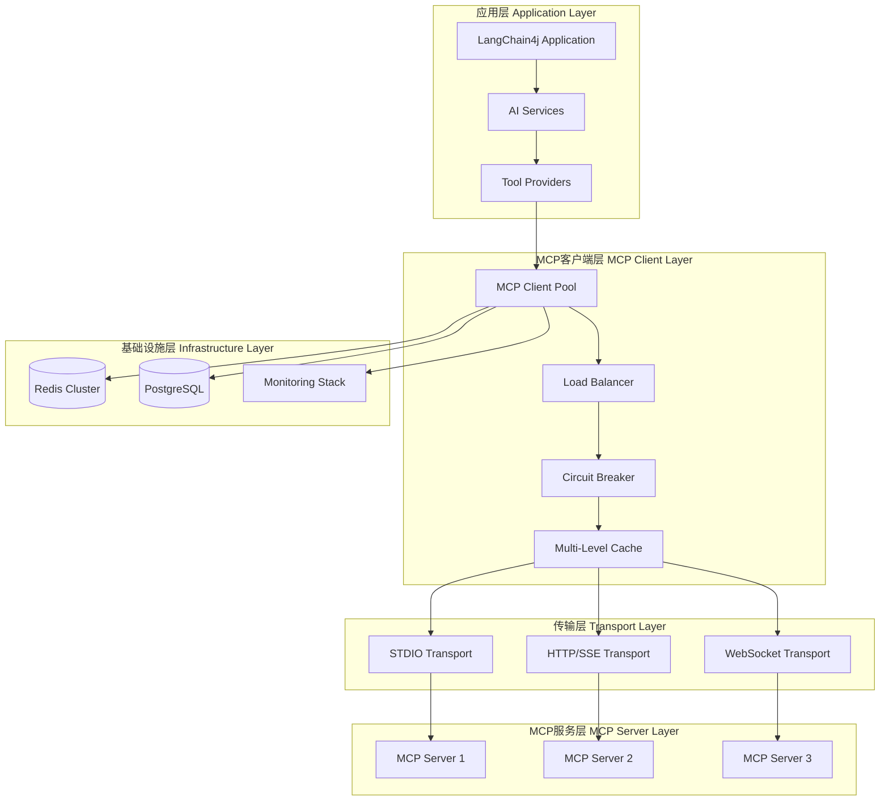
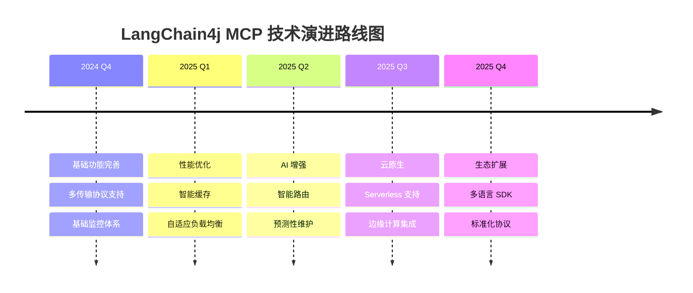

# LangChain4j MCP 技术总结与最佳实践

> **LangChain4j MCP 系列总结篇** - 全面总结 LangChain4j MCP 技术栈的核心要点、最佳实践和未来发展方向

## 📋 目录

- [技术架构总结](#技术架构总结)
- [核心特性回顾](#核心特性回顾)
- [最佳实践汇总](#最佳实践汇总)
- [性能优化要点](#性能优化要点)
- [生产环境经验](#生产环境经验)
- [未来发展方向](#未来发展方向)

## 🏗️ 技术架构总结

### 整体架构图



### 核心组件职责

| 组件 | 职责 | 关键特性 |
|------|------|---------|
| **MCP Client** | 协议通信、连接管理 | 连接池、重连机制、协议适配 |
| **Load Balancer** | 负载分发、故障转移 | 智能路由、健康检查、权重分配 |
| **Circuit Breaker** | 故障隔离、服务保护 | 熔断策略、自动恢复、降级处理 |
| **Cache Manager** | 数据缓存、性能优化 | 多级缓存、智能预热、过期策略 |
| **Transport Layer** | 底层通信、协议支持 | STDIO、HTTP/SSE、WebSocket |
| **Monitoring** | 监控告警、性能分析 | 指标收集、链路追踪、智能告警 |

## ⭐ 核心特性回顾

### 1. 统一的 API 接口

```java
// 简洁的工具调用接口
public interface McpClient {
    CompletableFuture<ToolExecutionResult> executeTool(ToolExecutionRequest request);
    CompletableFuture<List<Tool>> listTools();
    CompletableFuture<Void> initialize();
    CompletableFuture<Void> close();
}

// 与 AI 模型的无缝集成
@Service
public class AiAssistantService {
    public McpAssistant createAssistant() {
        return AiServices.builder(McpAssistant.class)
            .chatModel(openAiChatModel)
            .toolProvider(McpToolProvider.builder()
                .mcpClients(mcpClient)
                .build())
            .build();
    }
}
```

### 2. 多传输协议支持

```java
// STDIO 传输 - 适用于本地服务
StdioMcpTransport stdioTransport = new StdioMcpTransport.Builder()
    .command(Arrays.asList("npx", "mcp-server"))
    .logEvents(true)
    .build();

// HTTP/SSE 传输 - 适用于远程服务
HttpMcpTransport httpTransport = new HttpMcpTransport.Builder()
    .sseUrl("https://api.example.com/mcp")
    .timeout(Duration.ofSeconds(30))
    .build();

// WebSocket 传输 - 适用于实时通信
WebSocketMcpTransport wsTransport = new WebSocketMcpTransport.Builder()
    .uri("wss://api.example.com/mcp")
    .reconnectEnabled(true)
    .build();
```

### 3. 企业级特性

```java
// 连接池管理
@Bean
public McpClientPool mcpClientPool() {
    return McpClientPool.builder()
        .minSize(5)
        .maxSize(50)
        .healthCheckInterval(Duration.ofSeconds(30))
        .build();
}

// 智能负载均衡
@Bean
public McpLoadBalancer loadBalancer() {
    return McpLoadBalancer.builder()
        .strategy(LoadBalancingStrategy.WEIGHTED_ROUND_ROBIN)
        .healthCheckEnabled(true)
        .failoverEnabled(true)
        .build();
}

// 多级缓存
@Bean
public MultiLevelCacheManager cacheManager() {
    return MultiLevelCacheManager.builder()
        .l1Cache(caffeineCache)
        .l2Cache(redisCache)
        .l3Cache(databaseCache)
        .build();
}
```

## 🎯 最佳实践汇总

### 1. 架构设计最佳实践

#### 分层架构原则
```java
// 清晰的分层结构
@RestController
@RequestMapping("/api/v1/mcp")
public class McpController {
    private final McpService mcpService; // 业务层
}

@Service
public class McpService {
    private final McpClientManager clientManager; // 客户端管理层
}

@Component
public class McpClientManager {
    private final McpTransport transport; // 传输层
}
```

#### 依赖注入与配置管理
```java
// 外部化配置
@ConfigurationProperties(prefix = "mcp.client")
@Data
public class McpClientProperties {
    private Pool pool = new Pool();
    private Security security = new Security();
    private Monitoring monitoring = new Monitoring();
    
    @Data
    public static class Pool {
        private int minSize = 5;
        private int maxSize = 50;
        private Duration maxWait = Duration.ofSeconds(30);
    }
}
```

### 2. 错误处理最佳实践

#### 分层错误处理
```java
// 自定义异常体系
public class McpException extends RuntimeException {
    private final ErrorCode errorCode;
    private final String details;
}

public enum ErrorCode {
    CONNECTION_FAILED("MCP_001", "Connection failed"),
    TOOL_NOT_FOUND("MCP_002", "Tool not found"),
    EXECUTION_TIMEOUT("MCP_003", "Execution timeout"),
    INVALID_ARGUMENTS("MCP_004", "Invalid arguments");
}

// 全局异常处理
@ControllerAdvice
public class McpExceptionHandler {
    @ExceptionHandler(McpException.class)
    public ResponseEntity<ErrorResponse> handleMcpException(McpException e) {
        return ResponseEntity.status(HttpStatus.BAD_REQUEST)
            .body(ErrorResponse.builder()
                .code(e.getErrorCode().getCode())
                .message(e.getErrorCode().getMessage())
                .details(e.getDetails())
                .timestamp(Instant.now())
                .build());
    }
}
```

#### 重试与熔断策略
```java
// 智能重试配置
@Bean
public Retry mcpRetry() {
    return Retry.ofDefaults("mcp-client")
        .toBuilder()
        .maxAttempts(3)
        .waitDuration(Duration.ofSeconds(1))
        .retryOnException(throwable -> 
            throwable instanceof ConnectException ||
            throwable instanceof SocketTimeoutException)
        .build();
}

// 熔断器配置
@Bean
public CircuitBreaker mcpCircuitBreaker() {
    return CircuitBreaker.ofDefaults("mcp-client")
        .toBuilder()
        .failureRateThreshold(50)
        .waitDurationInOpenState(Duration.ofSeconds(30))
        .slidingWindowSize(10)
        .build();
}
```

### 3. 性能优化最佳实践

#### 连接池优化
```java
// 自适应连接池
@Component
public class AdaptiveConnectionPool {
    
    @Scheduled(fixedRate = 60000)
    public void adjustPoolSize() {
        double utilization = getCurrentUtilization();
        int currentSize = getCurrentPoolSize();
        
        if (utilization > 0.8) {
            increasePoolSize(Math.min(currentSize * 2, MAX_POOL_SIZE));
        } else if (utilization < 0.3) {
            decreasePoolSize(Math.max(currentSize / 2, MIN_POOL_SIZE));
        }
    }
}
```

#### 缓存策略优化
```java
// 智能缓存策略
@Component
public class IntelligentCacheStrategy {
    
    public CachePolicy determineCachePolicy(String toolName, ToolExecutionResult result) {
        // 基于工具特性和历史数据确定缓存策略
        ToolMetrics metrics = getToolMetrics(toolName);
        
        Duration ttl = calculateOptimalTTL(metrics);
        CacheLevel level = determineOptimalCacheLevel(metrics);
        
        return CachePolicy.builder()
            .ttl(ttl)
            .level(level)
            .compressionEnabled(result.getContent().toString().length() > 1024)
            .build();
    }
}
```

### 4. 安全最佳实践

#### 认证与授权
```java
// JWT 认证配置
@Configuration
@EnableWebSecurity
public class SecurityConfiguration {
    
    @Bean
    public SecurityFilterChain filterChain(HttpSecurity http) throws Exception {
        return http
            .authorizeHttpRequests(authz -> authz
                .requestMatchers("/api/v1/mcp/**").authenticated()
                .anyRequest().permitAll()
            )
            .oauth2ResourceServer(oauth2 -> oauth2
                .jwt(jwt -> jwt.jwtAuthenticationConverter(jwtConverter()))
            )
            .build();
    }
}
```

#### 数据加密
```java
// 敏感数据加密
@Component
public class DataEncryptionService {
    
    @Value("${mcp.encryption.key}")
    private String encryptionKey;
    
    public String encryptSensitiveData(String data) {
        return AES.encrypt(data, encryptionKey);
    }
    
    public String decryptSensitiveData(String encryptedData) {
        return AES.decrypt(encryptedData, encryptionKey);
    }
}
```

## ⚡ 性能优化要点

### 1. JVM 调优参数

```bash
# 生产环境 JVM 参数
JAVA_OPTS="-server \
  -Xms4g -Xmx4g \
  -XX:+UseG1GC \
  -XX:MaxGCPauseMillis=200 \
  -XX:G1HeapRegionSize=16m \
  -XX:+HeapDumpOnOutOfMemoryError \
  -XX:HeapDumpPath=/var/log/mcp/ \
  -Djava.security.egd=file:/dev/./urandom"
```

### 2. 关键性能指标

| 指标类别 | 关键指标 | 目标值 | 监控方法 |
|---------|---------|--------|---------|
| **响应时间** | P95 延迟 | < 2s | Prometheus + Grafana |
| **吞吐量** | TPS | > 1000 | 应用指标 |
| **错误率** | 错误率 | < 1% | 日志分析 |
| **资源使用** | CPU 使用率 | < 70% | 系统监控 |
| **资源使用** | 内存使用率 | < 80% | JVM 监控 |
| **连接池** | 连接利用率 | 60-80% | 连接池指标 |

### 3. 性能优化检查清单

- ✅ **连接池配置**: 合理设置最小/最大连接数
- ✅ **缓存策略**: 实施多级缓存和智能预热
- ✅ **异步处理**: 使用 CompletableFuture 和响应式编程
- ✅ **批处理优化**: 合并小请求，减少网络开销
- ✅ **资源管理**: 及时释放资源，避免内存泄漏
- ✅ **监控告警**: 建立完善的性能监控体系

## 🚀 生产环境经验

### 1. 部署架构建议

```yaml
# 推荐的 Kubernetes 部署配置
apiVersion: apps/v1
kind: Deployment
metadata:
  name: langchain4j-mcp-app
spec:
  replicas: 3
  strategy:
    type: RollingUpdate
    rollingUpdate:
      maxSurge: 1
      maxUnavailable: 0
  template:
    spec:
      containers:
      - name: app
        image: langchain4j-mcp:latest
        resources:
          requests:
            memory: "2Gi"
            cpu: "500m"
          limits:
            memory: "4Gi"
            cpu: "2000m"
        livenessProbe:
          httpGet:
            path: /actuator/health/liveness
            port: 8080
          initialDelaySeconds: 60
        readinessProbe:
          httpGet:
            path: /actuator/health/readiness
            port: 8080
          initialDelaySeconds: 30
```

### 2. 监控告警配置

```yaml
# Prometheus 告警规则
groups:
- name: langchain4j-mcp-alerts
  rules:
  - alert: HighErrorRate
    expr: rate(mcp_tool_errors_total[5m]) / rate(mcp_tool_calls_total[5m]) > 0.05
    for: 2m
    labels:
      severity: warning
    annotations:
      summary: "High error rate detected"
      
  - alert: HighLatency
    expr: histogram_quantile(0.95, rate(mcp_tool_execution_duration_bucket[5m])) > 5
    for: 3m
    labels:
      severity: warning
    annotations:
      summary: "High latency detected"
```

### 3. 运维自动化脚本

```bash
#!/bin/bash
# 健康检查脚本
check_mcp_health() {
    local endpoint="http://localhost:8080/actuator/health"
    local response=$(curl -s -w "%{http_code}" -o /dev/null "$endpoint")
    
    if [ "$response" = "200" ]; then
        echo "✅ MCP service is healthy"
        return 0
    else
        echo "❌ MCP service is unhealthy (HTTP $response)"
        return 1
    fi
}

# 性能检查脚本
check_performance() {
    local metrics_endpoint="http://localhost:8080/actuator/prometheus"
    local error_rate=$(curl -s "$metrics_endpoint" | grep "mcp_tool_errors_total" | tail -1)
    local latency=$(curl -s "$metrics_endpoint" | grep "mcp_tool_execution_duration" | tail -1)
    
    echo "📊 Current Performance Metrics:"
    echo "Error Rate: $error_rate"
    echo "Latency: $latency"
}
```

## 🔮 未来发展方向

### 1. 技术演进路线图



### 2. 新兴技术集成

#### AI 驱动的智能优化
```java
// AI 驱动的性能调优
@Component
public class AiDrivenOptimizer {
    
    private final MachineLearningModel performanceModel;
    
    public OptimizationRecommendation generateRecommendations(SystemMetrics metrics) {
        // 使用机器学习模型分析性能数据
        PerformanceAnalysis analysis = performanceModel.analyze(metrics);
        
        return OptimizationRecommendation.builder()
            .connectionPoolAdjustment(analysis.getOptimalPoolSize())
            .cacheStrategyUpdate(analysis.getOptimalCacheStrategy())
            .loadBalancingUpdate(analysis.getOptimalLoadBalancing())
            .build();
    }
}
```

#### Serverless 架构支持
```java
// Serverless 函数适配器
@Component
public class ServerlessMcpAdapter {
    
    public CompletableFuture<ToolExecutionResult> executeFunctionTool(
            String functionName, Map<String, Object> arguments) {
        
        return serverlessInvoker.invokeFunction(functionName, arguments)
            .thenApply(this::convertToToolResult);
    }
}
```

### 3. 标准化与生态建设

#### 协议标准化
- **MCP 2.0 协议**：支持更丰富的数据类型和交互模式
- **工具描述标准**：统一的工具元数据格式
- **安全规范**：端到端加密和身份验证标准

#### 生态系统扩展
- **多语言 SDK**：Python、Go、Rust 等语言支持
- **工具市场**：开源工具库和商业工具集成
- **开发者工具**：调试器、性能分析器、测试框架

## 📊 技术选型建议

### 1. 场景化技术选型

| 应用场景 | 推荐配置 | 关键考虑因素 |
|---------|---------|-------------|
| **小型应用** | 单实例 + 本地缓存 | 简单部署、低成本 |
| **中型应用** | 多实例 + Redis 缓存 | 高可用、适度扩展 |
| **大型应用** | 微服务 + 分布式缓存 | 高并发、可扩展性 |
| **企业级应用** | 云原生 + 全栈监控 | 安全性、合规性 |

### 2. 技术栈推荐

```java
// 推荐的技术栈配置
@Configuration
public class RecommendedTechStack {
    
    // Web 框架：Spring Boot
    @Bean
    public WebMvcConfigurer webMvcConfigurer() {
        return new WebMvcConfigurer() {
            // 配置 CORS、拦截器等
        };
    }
    
    // 数据库：PostgreSQL + Redis
    @Bean
    public DataSource dataSource() {
        return HikariDataSource.builder()
            .jdbcUrl("jdbc:postgresql://localhost:5432/mcp")
            .build();
    }
    
    // 监控：Prometheus + Grafana
    @Bean
    public MeterRegistry meterRegistry() {
        return new PrometheusMeterRegistry(PrometheusConfig.DEFAULT);
    }
    
    // 日志：Logback + ELK Stack
    @Bean
    public Logger structuredLogger() {
        return LoggerFactory.getLogger("mcp-structured");
    }
}
```

## 🎯 总结

LangChain4j MCP 技术栈为构建企业级 AI 应用提供了强大的基础设施支持。通过本系列文档的学习，您应该能够：

1. **理解核心概念**：掌握 MCP 协议和 LangChain4j 框架的基本原理
2. **实现基础功能**：构建可用的 MCP 客户端和工具集成
3. **应用高级特性**：实施连接池、负载均衡、缓存等企业级特性
4. **部署生产环境**：配置监控、安全和高可用架构
5. **优化性能表现**：通过调优和监控提升系统性能
6. **保证代码质量**：建立完善的测试和质量保证体系

### 关键成功因素

- 🎯 **明确的架构设计**：分层清晰、职责明确
- 🔧 **完善的工程实践**：代码规范、测试覆盖、持续集成
- 📊 **全面的监控体系**：指标收集、告警机制、性能分析
- 🛡️ **可靠的安全保障**：认证授权、数据加密、安全审计
- 🚀 **持续的优化改进**：性能调优、技术升级、最佳实践

通过遵循这些最佳实践和技术指导，您可以构建出高质量、高性能、高可用的 LangChain4j MCP 应用系统。
Å
