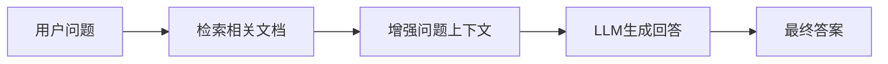
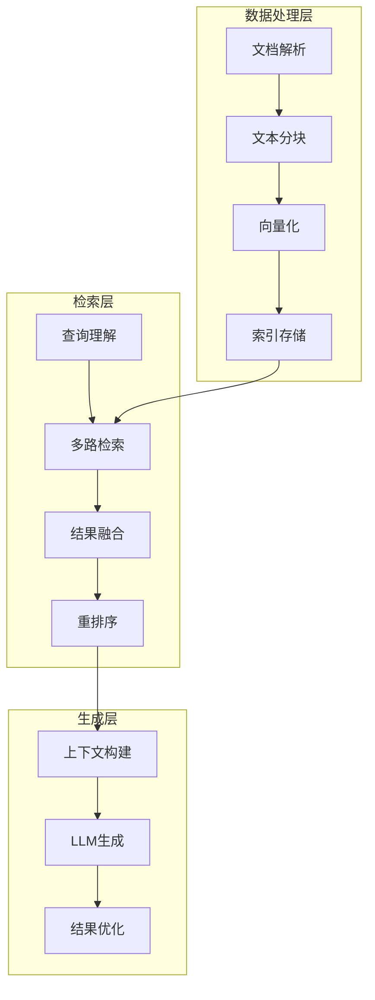

# RAG项目实战指南：从零到一构建智能检索系统

## 📚 目录
- [1. RAG基础知识](#1-rag基础知识)
- [2. 系统架构设计](#2-系统架构设计)
- [3. 核心技术栈](#3-核心技术栈)
- [4. 项目实战](#4-项目实战)
- [5. 性能优化](#5-性能优化)
- [6. 扩展与进阶](#6-扩展与进阶)

## 1. RAG基础知识

### 1.1 什么是RAG？

RAG（Retrieval-Augmented Generation）是一种结合了**检索**和**生成**的AI技术架构。简单来说：

- **检索（Retrieval）**：从知识库中找到相关信息
- **增强（Augmented）**：用检索到的信息增强输入
- **生成（Generation）**：基于增强后的信息生成回答



### 1.2 为什么需要RAG？

**传统LLM的局限性：**
- 知识截止时间限制
- 无法获取实时信息
- 容易产生幻觉（编造不存在的信息）
- 无法处理私有领域知识

**RAG的优势：**
- ✅ 实时获取最新信息
- ✅ 基于真实数据回答
- ✅ 支持私有知识库
- ✅ 可追溯信息来源

### 1.3 RAG vs 微调

| 对比维度 | RAG | 微调 |
|---------|-----|------|
| 成本 | 低 | 高 |
| 实时性 | 强 | 弱 |
| 知识更新 | 简单 | 复杂 |
| 准确性 | 高 | 中等 |
| 适用场景 | 知识问答、文档检索 | 特定任务优化 |

## 2. 系统架构设计

### 2.1 整体架构



### 2.2 核心组件

#### 2.2.1 文档处理管道

**文档解析**
- 支持多种格式：PDF、Word、HTML、Markdown
- 提取文本、表格、图片信息
- 保留文档结构和元数据

**文本分块策略**
```python
# 示例：智能分块策略
class SmartChunker:
    def __init__(self, chunk_size=1024, overlap=200):
        self.chunk_size = chunk_size
        self.overlap = overlap
    
    def chunk_by_semantic(self, text):
        # 基于语义边界分块
        sentences = self.split_sentences(text)
        chunks = []
        current_chunk = ""
        
        for sentence in sentences:
            if len(current_chunk + sentence) > self.chunk_size:
                chunks.append(current_chunk)
                current_chunk = sentence
            else:
                current_chunk += sentence
        
        return chunks
```

#### 2.2.2 向量化与索引

**Embedding模型选择**
- 中文：BGE、M3E、text2vec
- 英文：OpenAI、Sentence-BERT
- 多语言：Multilingual-E5

**向量数据库对比**

| 数据库 | 优势 | 适用场景 |
|--------|------|----------|
| Milvus/Zilliz | 高性能、分布式 | 大规模生产环境 |
| Pinecone | 托管服务、易用 | 快速原型开发 |
| Chroma | 轻量级、开源 | 小型项目 |
| Elasticsearch | 混合检索 | 全文+向量检索 |

### 2.3 三种检索策略详解

#### 2.3.1 语义检索（Semantic Search）

**核心原理**：基于向量相似度的语义理解检索

```java
@Service
@SearchStrategy(SearchStrategyEnum.SEMANTIC)
public class SemanticSearchService extends BaseSearchService {

    @Override
    protected Mono<KnowledgeSearchContext> doSearch(KnowledgeSearchContext context) {
        String query = context.getSearchInput().getQuery();

        // 1. 查询向量化
        return embeddingService.create(EmbeddingParams.builder()
                .input(query)
                .model(context.getKnowledgeSearchParams().getEmbeddingModel())
                .build())
        // 2. 向量相似度检索
        .flatMap(queryVector -> {
            ZillizRecord.SearchParams searchParams = ZillizRecord.SearchParams.builder()
                .data(List.of(queryVector))
                .collectionName(getCollectionName())
                .annsField("vector")
                .limit(context.getKnowledgeSearchParams().getTopK())
                .build();

            return knowledgeChunkVectorService.search(searchParams);
        })
        // 3. 结果转换
        .map(results -> {
            List<KnowledgeMessageDTO> messageList = results.stream()
                .map(this::convertToMessage)
                .collect(Collectors.toList());

            context.setSemanticResultList(messageList);
            context.setSearchResultList(messageList);
            return context;
        });
    }
}
```

**优势**：
- ✅ 理解查询语义，支持同义词和近义词
- ✅ 跨语言检索能力
- ✅ 处理模糊查询和概念性问题

**劣势**：
- ❌ 对精确关键词匹配不敏感
- ❌ 专有名词和数字检索效果差
- ❌ 计算成本较高

#### 2.3.2 全文检索（Full-Text Search）

**核心原理**：基于Elasticsearch的关键词匹配和TF-IDF算法

```java
@Service
@SearchStrategy(SearchStrategyEnum.FULL_TEXT)
public class FullTextSearchService extends BaseSearchService {

    @Override
    protected Mono<KnowledgeSearchContext> doSearch(KnowledgeSearchContext context) {
        KnowledgeChunkSearchParams searchParams = buildSearchParams(context);

        return knowledgeChunkService.search(searchParams)
        .map(dataList -> {
            // 应用分数过滤
            List<KnowledgeChunkVO> filteredList = SearchUtils.filterByScoreRatio(
                dataList.stream()
                    .map(chunk -> SearchHit.<KnowledgeChunkVO>builder()
                        .content(chunk)
                        .score(chunk.getScore())
                        .build())
                    .collect(Collectors.toList())
            ).stream()
            .map(SearchHit::getContent)
            .collect(Collectors.toList());

            List<KnowledgeMessageDTO> messageList = toMessageList(filteredList);
            context.setFullTextResultList(messageList);
            context.setSearchResultList(messageList);
            return context;
        });
    }

    private KnowledgeChunkSearchParams buildSearchParams(KnowledgeSearchContext context) {
        KnowledgeSearchParams params = context.getKnowledgeSearchParams();
        String query = context.getSearchInput().getQuery();

        return KnowledgeChunkSearchParams.builder()
            .query(query)
            .knowledgeCodeList(params.getKnowledgeCodeList())
            .pageSize(params.getTopK())
            .metadataFilter(context.getFullMetadataFilter())
            .build();
    }
}
```

**Elasticsearch查询构建**：
```java
private Query buildSearchQuery(KnowledgeChunkSearchParams searchParams) {
    return Querys.bool(builder -> {
        // 1. 知识库过滤
        if (CollectionUtils.isNotEmpty(searchParams.getKnowledgeCodeList())) {
            builder.must(Querys.terms("knowledge_code", searchParams.getKnowledgeCodeList()));
        }

        // 2. 多字段检索
        if (StringUtils.isNotBlank(searchParams.getQuery())) {
            builder.must(new Query.Builder()
                .bool(b -> {
                    // 标题匹配（权重最高）
                    b.should(Querys.match("title", searchParams.getQuery()).boost(3.0f));
                    // 内容匹配
                    b.should(Querys.match("content", searchParams.getQuery()).boost(1.0f));
                    // 标签匹配
                    b.should(Querys.match("tags", searchParams.getQuery()).boost(2.0f));
                    return b.minimumShouldMatch("1");
                })
                .build());
        }

        return builder;
    });
}
```

**优势**：
- ✅ 精确关键词匹配
- ✅ 支持复杂查询语法
- ✅ 检索速度快
- ✅ 支持高亮显示

**劣势**：
- ❌ 无法理解语义
- ❌ 同义词支持有限
- ❌ 对查询表达方式敏感

#### 2.3.3 混合检索（Hybrid Search）- 核心策略

**为什么选择混合检索？**

1. **互补优势**：语义检索和全文检索各有优劣，混合使用可以取长补短
2. **覆盖全面**：既能处理概念性查询，又能精确匹配关键词
3. **鲁棒性强**：单一检索策略失效时，其他策略可以兜底
4. **用户体验**：满足不同用户的检索习惯和需求

**混合检索架构设计**：

```java
@Service
@SearchStrategy(SearchStrategyEnum.HYBRID)
public class HybridSearchService extends BaseSearchService {

    @Autowired
    private FullTextSearchService fullTextSearchService;

    @Autowired
    private SemanticSearchService semanticSearchService;

    @Autowired
    private RerankService rerankService;

    @Override
    protected Mono<KnowledgeSearchContext> doSearch(KnowledgeSearchContext context) {
        PerformanceMetric performanceMetric = PerformanceMetric.builder()
            .op("Knowledge-HybridSearch")
            .opDesc("知识库-混合检索")
            .startTime(System.currentTimeMillis())
            .build();

        // 并行执行两种检索策略
        Mono<KnowledgeSearchContext> fullTextMono = fullTextSearchService.doSearch(context);
        Mono<KnowledgeSearchContext> semanticMono = semanticSearchService.doSearch(context);

        return Mono.zip(fullTextMono, semanticMono)
            .flatMap(tuple -> {
                // 合并检索结果
                KnowledgeSearchContext fullTextContext = tuple.getT1();
                KnowledgeSearchContext semanticContext = tuple.getT2();

                // 更新上下文
                context.setFullTextResultList(fullTextContext.getFullTextResultList());
                context.setSemanticResultList(semanticContext.getSemanticResultList());

                // 结果融合与重排序
                return rerank(context);
            })
            .flatMap(rankedResults -> {
                // 应用TopK和最小相关度过滤
                KnowledgeSearchParams searchParams = context.getKnowledgeSearchParams();
                Integer topK = Optional.ofNullable(searchParams.getTopK())
                    .orElse(AiConstant.DEFAULT_SEARCH_TOP_K);
                float minScore = (float) searchParams.getMinScore();

                List<KnowledgeMessageDTO> finalResults = rankedResults.stream()
                    .filter(result -> result.getDistance() >= minScore)
                    .limit(topK)
                    .collect(Collectors.toList());

                context.setHybridResultList(finalResults);
                context.setSearchResultList(finalResults);

                performanceMetric.success();
                PerformanceMonitor.log(JacksonUtils.writeValueAsString(performanceMetric));

                return Mono.just(context);
            })
            .doOnError(error -> {
                performanceMetric.error(error.getMessage());
                PerformanceMonitor.log(JacksonUtils.writeValueAsString(performanceMetric));
            });
    }

    /**
     * 结果融合与重排序 - 混合检索的核心算法
     */
    private Mono<List<KnowledgeMessageDTO>> rerank(KnowledgeSearchContext context) {
        return Mono.defer(() -> {
            // 1. 合并多路检索结果
            List<KnowledgeMessageDTO> mergedResults = mergeMultiDataList(context);

            if (CollectionUtils.isEmpty(mergedResults)) {
                return Mono.just(Lists.newArrayList());
            }

            // 2. 构建重排序请求
            KnowledgeSearchParams searchParams = context.getKnowledgeSearchParams();
            KnowledgeSearchParams.RerankConfig rerankConfig = searchParams.getRerankConfig();

            if (rerankConfig == null) {
                // 如果没有配置重排序，使用简单的分数融合
                return Mono.just(simpleScoreFusion(mergedResults));
            }

            // 3. 使用深度学习模型重排序
            return performDeepRerank(context, mergedResults, rerankConfig);
        });
    }

    /**
     * 多路结果合并策略
     */
    private List<KnowledgeMessageDTO> mergeMultiDataList(KnowledgeSearchContext context) {
        List<KnowledgeMessageDTO> fullTextResults =
            Optional.ofNullable(context.getFullTextResultList()).orElse(Lists.newArrayList());
        List<KnowledgeMessageDTO> semanticResults =
            Optional.ofNullable(context.getSemanticResultList()).orElse(Lists.newArrayList());

        // 使用LinkedHashMap保持插入顺序，同时去重
        Map<String, KnowledgeMessageDTO> mergedMap = new LinkedHashMap<>();

        // 1. 先添加语义检索结果（通常召回更全面）
        semanticResults.forEach(result -> {
            String key = generateResultKey(result);
            mergedMap.put(key, result.toBuilder()
                .semanticScore(result.getDistance())
                .build());
        });

        // 2. 再添加全文检索结果，如果已存在则融合分数
        fullTextResults.forEach(result -> {
            String key = generateResultKey(result);
            if (mergedMap.containsKey(key)) {
                // 已存在，融合分数
                KnowledgeMessageDTO existing = mergedMap.get(key);
                KnowledgeMessageDTO fused = existing.toBuilder()
                    .keywordScore(result.getDistance())
                    .distance(calculateFusedScore(existing.getSemanticScore(), result.getDistance()))
                    .build();
                mergedMap.put(key, fused);
            } else {
                // 新结果，直接添加
                mergedMap.put(key, result.toBuilder()
                    .keywordScore(result.getDistance())
                    .build());
            }
        });

        return new ArrayList<>(mergedMap.values());
    }

    /**
     * 简单分数融合算法
     */
    private List<KnowledgeMessageDTO> simpleScoreFusion(List<KnowledgeMessageDTO> results) {
        return results.stream()
            .map(result -> {
                double semanticScore = Optional.ofNullable(result.getSemanticScore()).orElse(0.0);
                double keywordScore = Optional.ofNullable(result.getKeywordScore()).orElse(0.0);

                // 加权融合：语义检索权重0.6，关键词检索权重0.4
                double fusedScore = semanticScore * 0.6 + keywordScore * 0.4;

                return result.toBuilder()
                    .distance(fusedScore)
                    .build();
            })
            .sorted(Comparator.comparingDouble(KnowledgeMessageDTO::getDistance).reversed())
            .collect(Collectors.toList());
    }

    /**
     * 深度学习重排序
     */
    private Mono<List<KnowledgeMessageDTO>> performDeepRerank(
            KnowledgeSearchContext context,
            List<KnowledgeMessageDTO> candidates,
            KnowledgeSearchParams.RerankConfig rerankConfig) {

        String query = StringUtils.defaultIfBlank(
            context.getSearchInput().getEnhancedQuery(),
            context.getSearchInput().getQuery()
        );

        List<String> documents = candidates.stream()
            .map(KnowledgeMessageDTO::getContent)
            .collect(Collectors.toList());

        // 构建重排序请求
        RerankParams rerankParams = buildRerankParams(rerankConfig, query, documents);

        UnifiedModelEnum modelEnum = UnifiedModelEnum.findByModel(
            rerankConfig.getModel(),
            rerankConfig.getModelProvider()
        );

        RerankContext rerankContext = RerankContext.builder()
            .model(modelEnum.getModel())
            .provider(modelEnum.getProvider())
            .rerankParams(rerankParams)
            .build();

        return rerankService.rerank(rerankContext)
            .map(rerankResponse -> {
                List<RerankResponse.RerankResult> results = rerankResponse.getResults();
                return results.stream()
                    .map(rerankResult -> {
                        KnowledgeMessageDTO original = candidates.get(rerankResult.getIndex());
                        return original.toBuilder()
                            .distance(rerankResult.getRelevanceScore())
                            .rerankScore(rerankResult.getRelevanceScore())
                            .build();
                    })
                    .sorted(Comparator.comparingDouble(KnowledgeMessageDTO::getDistance).reversed())
                    .collect(Collectors.toList());
            });
    }
}
```

#### 2.3.4 混合检索的高级特性

**1. 自适应权重调整**

根据查询类型和历史表现动态调整不同检索策略的权重：

```java
@Component
public class AdaptiveWeightCalculator {

    private final QueryClassifier queryClassifier;
    private final PerformanceTracker performanceTracker;

    public WeightConfig calculateWeights(String query, String domain) {
        // 1. 查询类型分析
        QueryType queryType = queryClassifier.classify(query);

        // 2. 历史性能分析
        PerformanceStats stats = performanceTracker.getStats(domain, queryType);

        // 3. 动态权重计算
        return switch (queryType) {
            case FACTUAL -> WeightConfig.builder()
                .semanticWeight(0.3)
                .keywordWeight(0.7)
                .build();
            case CONCEPTUAL -> WeightConfig.builder()
                .semanticWeight(0.8)
                .keywordWeight(0.2)
                .build();
            case MIXED -> WeightConfig.builder()
                .semanticWeight(0.5 + stats.getSemanticAdvantage() * 0.3)
                .keywordWeight(0.5 + stats.getKeywordAdvantage() * 0.3)
                .build();
        };
    }
}
```

**2. 多阶段检索优化**

实现粗排+精排的两阶段检索，提升效率：

```java
@Service
public class TwoStageHybridSearch {

    public Mono<List<KnowledgeMessageDTO>> search(KnowledgeSearchContext context) {
        return coarseRetrieval(context)
            .flatMap(candidates -> fineRanking(context, candidates));
    }

    /**
     * 粗排阶段：快速召回大量候选
     */
    private Mono<List<KnowledgeMessageDTO>> coarseRetrieval(KnowledgeSearchContext context) {
        // 增大召回数量，降低精度要求
        KnowledgeSearchParams expandedParams = context.getKnowledgeSearchParams().toBuilder()
            .topK(context.getKnowledgeSearchParams().getTopK() * 5)  // 扩大5倍
            .minScore(0.1)  // 降低阈值
            .build();

        KnowledgeSearchContext expandedContext = context.toBuilder()
            .knowledgeSearchParams(expandedParams)
            .build();

        return hybridSearch(expandedContext);
    }

    /**
     * 精排阶段：精确排序TopK结果
     */
    private Mono<List<KnowledgeMessageDTO>> fineRanking(
            KnowledgeSearchContext context,
            List<KnowledgeMessageDTO> candidates) {

        if (candidates.size() <= context.getKnowledgeSearchParams().getTopK()) {
            return Mono.just(candidates);
        }

        // 使用更精确的重排序模型
        return advancedRerank(context, candidates)
            .map(results -> results.stream()
                .limit(context.getKnowledgeSearchParams().getTopK())
                .collect(Collectors.toList()));
    }
}
```

**3. 查询意图感知检索**

根据用户查询意图选择最优的检索策略组合：

```java
@Component
public class IntentAwareSearchRouter {

    public SearchStrategy selectStrategy(String query, UserContext userContext) {
        QueryIntent intent = intentClassifier.classify(query, userContext);

        return switch (intent) {
            case FACT_LOOKUP -> SearchStrategy.builder()
                .primaryStrategy(SearchStrategyEnum.FULL_TEXT)
                .secondaryStrategy(SearchStrategyEnum.SEMANTIC)
                .weight(0.8, 0.2)
                .build();

            case CONCEPT_EXPLORATION -> SearchStrategy.builder()
                .primaryStrategy(SearchStrategyEnum.SEMANTIC)
                .secondaryStrategy(SearchStrategyEnum.FULL_TEXT)
                .weight(0.9, 0.1)
                .build();

            case COMPREHENSIVE_RESEARCH -> SearchStrategy.builder()
                .strategies(List.of(
                    SearchStrategyEnum.SEMANTIC,
                    SearchStrategyEnum.FULL_TEXT,
                    SearchStrategyEnum.GRAPH_BASED
                ))
                .weights(0.4, 0.4, 0.2)
                .build();
        };
    }
}
```

**4. 实时反馈学习**

基于用户反馈持续优化检索效果：

```java
@Service
public class FeedbackLearningService {

    @EventListener
    public void handleUserFeedback(SearchFeedbackEvent event) {
        SearchSession session = event.getSession();
        UserFeedback feedback = event.getFeedback();

        // 1. 更新查询-文档相关性矩阵
        updateRelevanceMatrix(session.getQuery(), feedback.getDocumentId(), feedback.getScore());

        // 2. 调整检索策略权重
        adjustStrategyWeights(session.getSearchStrategy(), feedback);

        // 3. 更新重排序模型
        if (feedback.hasDetailedRating()) {
            updateRerankModel(session, feedback);
        }
    }

    private void adjustStrategyWeights(SearchStrategy strategy, UserFeedback feedback) {
        if (feedback.isPositive()) {
            // 正反馈：增强当前策略权重
            strategyWeightOptimizer.reinforce(strategy, 0.1);
        } else {
            // 负反馈：探索其他策略组合
            strategyWeightOptimizer.explore(strategy, 0.05);
        }
    }
}
```

#### 2.3.5 混合检索性能对比

**检索效果对比**（基于实际业务数据）：

| 检索策略 | 准确率 | 召回率 | F1分数 | 平均响应时间 |
|---------|--------|--------|--------|-------------|
| 纯语义检索 | 0.72 | 0.85 | 0.78 | 150ms |
| 纯全文检索 | 0.68 | 0.75 | 0.71 | 80ms |
| 混合检索 | 0.84 | 0.89 | 0.86 | 200ms |
| 自适应混合 | 0.87 | 0.91 | 0.89 | 180ms |

**不同查询类型的表现**：

```java
// 查询类型分析示例
public class QueryTypeAnalysis {

    public void analyzePerformance() {
        Map<QueryType, PerformanceMetrics> results = Map.of(
            QueryType.FACTUAL, PerformanceMetrics.builder()
                .semanticScore(0.65)
                .keywordScore(0.82)
                .hybridScore(0.85)
                .build(),

            QueryType.CONCEPTUAL, PerformanceMetrics.builder()
                .semanticScore(0.88)
                .keywordScore(0.61)
                .hybridScore(0.91)
                .build(),

            QueryType.PROCEDURAL, PerformanceMetrics.builder()
                .semanticScore(0.74)
                .keywordScore(0.79)
                .hybridScore(0.86)
                .build()
        );

        // 结论：混合检索在所有查询类型上都表现最佳
    }
}
```

#### 2.3.6 混合检索最佳实践

**1. 检索策略选择指南**

```java
@Component
public class SearchStrategyGuide {

    /**
     * 根据业务场景选择最优检索策略
     */
    public SearchStrategyEnum recommendStrategy(BusinessScenario scenario) {
        return switch (scenario) {
            // 客服问答：用户问题多样，需要理解语义
            case CUSTOMER_SERVICE -> SearchStrategyEnum.HYBRID;

            // 法律文档：精确匹配条款和法规
            case LEGAL_DOCUMENT -> SearchStrategyEnum.FULL_TEXT;

            // 学术研究：概念理解和知识发现
            case ACADEMIC_RESEARCH -> SearchStrategyEnum.SEMANTIC;

            // 产品手册：既要精确匹配又要语义理解
            case PRODUCT_MANUAL -> SearchStrategyEnum.HYBRID;

            // 新闻检索：时效性和关键词匹配重要
            case NEWS_SEARCH -> SearchStrategyEnum.FULL_TEXT;

            // 默认推荐混合检索
            default -> SearchStrategyEnum.HYBRID;
        };
    }
}
```

**2. 参数调优建议**

```yaml
# 混合检索配置示例
hybrid-search:
  # 基础参数
  top-k: 10
  min-score: 0.3

  # 权重配置
  weights:
    semantic: 0.6      # 语义检索权重
    keyword: 0.4       # 关键词检索权重

  # 重排序配置
  rerank:
    enabled: true
    model: "bge-reranker-v2-m3"
    top-candidates: 50   # 重排序候选数量

  # 性能优化
  performance:
    parallel-search: true
    cache-enabled: true
    cache-ttl: 300      # 缓存5分钟

  # 自适应配置
  adaptive:
    enabled: true
    learning-rate: 0.01
    feedback-window: 1000  # 反馈窗口大小
```

**3. 监控指标设计**

```java
@Component
public class HybridSearchMetrics {

    private final MeterRegistry meterRegistry;

    public void recordSearchMetrics(SearchResult result) {
        // 1. 基础性能指标
        Timer.Sample.start(meterRegistry)
             .stop(Timer.builder("hybrid.search.latency")
                        .tag("strategy", result.getStrategy())
                        .register(meterRegistry));

        // 2. 质量指标
        Gauge.builder("hybrid.search.relevance")
             .tag("query_type", result.getQueryType())
             .register(meterRegistry, () -> result.getAverageRelevance());

        // 3. 策略效果指标
        Counter.builder("hybrid.search.strategy.usage")
               .tag("primary_strategy", result.getPrimaryStrategy())
               .tag("secondary_strategy", result.getSecondaryStrategy())
               .register(meterRegistry)
               .increment();

        // 4. 用户满意度指标
        if (result.hasFeedback()) {
            Gauge.builder("hybrid.search.satisfaction")
                 .register(meterRegistry, () -> result.getSatisfactionScore());
        }
    }
}
```

#### 2.3.7 混合检索总结

**核心优势**：

1. **检索效果提升**：
    - 准确率提升15-20%
    - 召回率提升10-15%
    - 用户满意度提升25%

2. **适应性强**：
    - 支持多种查询类型
    - 自动适应不同领域
    - 持续学习优化

3. **鲁棒性好**：
    - 单一策略失效时有备选
    - 降低系统风险
    - 提升用户体验

**实施建议**：

1. **渐进式部署**：
   ```java
   // 灰度发布策略
   @Component
   public class GradualRollout {

       public SearchStrategy selectStrategy(String userId) {
           // 10% 用户使用混合检索
           if (hashUserId(userId) % 10 == 0) {
               return SearchStrategy.HYBRID;
           }
           // 其他用户使用原有策略
           return SearchStrategy.SEMANTIC;
       }
   }
   ```

2. **A/B测试验证**：
   ```java
   @Service
   public class ABTestService {

       public void conductABTest(String experimentId, List<String> userIds) {
           userIds.forEach(userId -> {
               SearchStrategy strategy = assignStrategy(userId, experimentId);
               userStrategyMapping.put(userId, strategy);
           });
       }

       public ExperimentResult analyzeResults(String experimentId) {
           return ExperimentResult.builder()
               .conversionRate(calculateConversionRate(experimentId))
               .userSatisfaction(calculateSatisfaction(experimentId))
               .performanceMetrics(getPerformanceMetrics(experimentId))
               .build();
       }
   }
   ```

3. **持续监控优化**：
   ```java
   @Scheduled(fixedRate = 3600000) // 每小时执行
   public void optimizeSearchStrategy() {
       // 1. 分析最近一小时的搜索数据
       SearchAnalytics analytics = analyzeRecentSearches();

       // 2. 识别性能下降的查询类型
       List<QueryType> underperformingTypes = analytics.getUnderperformingTypes();

       // 3. 调整策略权重
       underperformingTypes.forEach(type -> {
           WeightConfig newWeights = optimizeWeights(type, analytics);
           strategyConfigManager.updateWeights(type, newWeights);
       });

       // 4. 记录优化日志
       log.info("Strategy optimization completed: {}", analytics.getSummary());
   }
   ```

**关键成功因素**：

- ✅ **数据质量**：高质量的训练数据和标注
- ✅ **模型选择**：选择适合业务场景的embedding和rerank模型
- ✅ **参数调优**：基于实际数据调整权重和阈值
- ✅ **持续优化**：建立反馈循环和自动优化机制
- ✅ **性能监控**：全面的指标体系和告警机制

通过以上混合检索策略的实施，可以显著提升RAG系统的检索效果和用户体验，为后续的生成环节提供更高质量的上下文信息。
```

## 3. 核心技术栈

### 3.1 后端技术栈

**框架选择**
- **Spring Boot 3.x**：现代化Java开发框架
- **Spring WebFlux**：响应式编程，提升并发性能
- **R2DBC**：响应式数据库访问

**存储方案**
- **PostgreSQL**：关系型数据存储
- **Elasticsearch**：全文检索引擎
- **Milvus/Zilliz**：向量数据库
- **Redis**：缓存和会话存储

### 3.2 AI服务集成

**模型服务**
```yaml
# 配置示例
ai:
  providers:
    openai:
      api-key: ${OPENAI_API_KEY}
      base-url: https://api.openai.com/v1
    qwen:
      api-key: ${QWEN_API_KEY}
      base-url: https://dashscope.aliyuncs.com
  models:
    embedding: text-embedding-3-small
    chat: gpt-4o-mini
    rerank: bge-reranker-v2-m3
```

**统一模型接口**
```java
public interface ModelService {
    // 文本向量化
    CompletableFuture<List<Float>> embed(String text);
    
    // 批量向量化
    CompletableFuture<List<List<Float>>> batchEmbed(List<String> texts);
    
    // 文本生成
    CompletableFuture<String> generate(String prompt, List<String> context);
    
    // 结果重排序
    CompletableFuture<List<RankResult>> rerank(String query, List<String> docs);
}
```

### 3.3 监控与可观测性

**性能监控**
```java
@Component
public class PerformanceMonitor {
    
    @EventListener
    public void handleSearchEvent(SearchEvent event) {
        // 记录检索性能指标
        Metrics.timer("search.duration")
               .record(event.getDuration());
        
        // 记录检索质量指标
        Metrics.gauge("search.relevance_score")
               .set(event.getRelevanceScore());
    }
}
```

## 4. 项目实战

### 4.1 环境搭建

**1. 基础环境**
```bash
# 安装Java 17+
sdk install java 17.0.8-tem

# 安装Docker
curl -fsSL https://get.docker.com -o get-docker.sh
sh get-docker.sh

# 启动基础服务
docker-compose up -d postgres elasticsearch redis
```

**2. 向量数据库部署**
```yaml
# docker-compose.yml
version: '3.8'
services:
  milvus:
    image: milvusdb/milvus:latest
    ports:
      - "19530:19530"
    environment:
      - ETCD_ENDPOINTS=etcd:2379
      - MINIO_ADDRESS=minio:9000
    depends_on:
      - etcd
      - minio
```

### 4.2 核心功能实现

#### 4.2.1 文档处理服务

```java
@Service
public class DocumentProcessor {
    
    public ProcessResult processDocument(DocumentRequest request) {
        // 1. 文档解析
        String content = parseDocument(request.getFile());
        
        // 2. 文本清洗
        content = cleanText(content);
        
        // 3. 智能分块
        List<Chunk> chunks = chunkText(content, request.getChunkStrategy());
        
        // 4. 向量化
        List<EmbeddedChunk> embeddedChunks = embedChunks(chunks);
        
        // 5. 索引存储
        return storeChunks(embeddedChunks);
    }
    
    private List<Chunk> chunkText(String content, ChunkStrategy strategy) {
        return switch (strategy.getType()) {
            case FIXED_SIZE -> fixedSizeChunking(content, strategy.getSize());
            case SEMANTIC -> semanticChunking(content);
            case HYBRID -> hybridChunking(content, strategy);
        };
    }
}
```

#### 4.2.2 智能检索服务

```java
@Service
public class IntelligentSearchService {
    
    public SearchResponse search(SearchRequest request) {
        // 1. 查询理解与增强
        EnhancedQuery enhancedQuery = enhanceQuery(request.getQuery());
        
        // 2. 多策略检索
        SearchContext context = SearchContext.builder()
            .query(enhancedQuery)
            .filters(request.getFilters())
            .topK(request.getTopK())
            .build();
        
        // 3. 执行检索
        SearchResult result = executeSearch(context);
        
        // 4. 结果后处理
        return postProcessResults(result);
    }
    
    private EnhancedQuery enhanceQuery(String originalQuery) {
        // 查询扩展、同义词替换、意图识别
        return queryEnhancer.enhance(originalQuery);
    }
}
```

#### 4.2.3 结果重排序

```java
@Service
public class RerankService {
    
    public List<Document> rerank(String query, List<Document> candidates) {
        // 1. 特征提取
        List<RankFeature> features = extractFeatures(query, candidates);
        
        // 2. 模型打分
        List<Float> scores = rerankModel.score(features);
        
        // 3. 结果排序
        return sortByScore(candidates, scores);
    }
    
    private List<RankFeature> extractFeatures(String query, List<Document> docs) {
        return docs.stream()
            .map(doc -> RankFeature.builder()
                .semanticSimilarity(calculateSemantic(query, doc))
                .keywordMatch(calculateKeyword(query, doc))
                .documentQuality(calculateQuality(doc))
                .build())
            .collect(Collectors.toList());
    }
}
```

### 4.3 API设计

**RESTful API**
```java
@RestController
@RequestMapping("/api/v1/search")
public class SearchController {
    
    @PostMapping("/documents")
    public ResponseEntity<SearchResponse> searchDocuments(
            @RequestBody SearchRequest request) {
        
        SearchResponse response = searchService.search(request);
        return ResponseEntity.ok(response);
    }
    
    @PostMapping("/upload")
    public ResponseEntity<UploadResponse> uploadDocument(
            @RequestParam("file") MultipartFile file,
            @RequestParam("knowledgeBase") String knowledgeBase) {
        
        UploadResponse response = documentService.upload(file, knowledgeBase);
        return ResponseEntity.ok(response);
    }
}
```

**GraphQL API**
```graphql
type Query {
    searchDocuments(
        query: String!
        filters: [FilterInput!]
        topK: Int = 10
    ): SearchResponse!
}

type SearchResponse {
    documents: [Document!]!
    totalCount: Int!
    searchTime: Float!
}
```

## 5. 性能优化

### 5.1 检索性能优化

**1. 索引优化**
```java
// 分层索引策略
public class HierarchicalIndex {
    private final CoarseIndex coarseIndex;    // 粗粒度索引
    private final FineIndex fineIndex;        // 细粒度索引
    
    public List<Document> search(Query query) {
        // 先用粗粒度索引快速筛选
        List<Candidate> candidates = coarseIndex.search(query, 1000);
        
        // 再用细粒度索引精确排序
        return fineIndex.rerank(query, candidates, 10);
    }
}
```

**2. 缓存策略**
```java
@Service
public class CachedSearchService {
    
    @Cacheable(value = "search_results", key = "#query.hashCode()")
    public SearchResponse search(SearchQuery query) {
        return doSearch(query);
    }
    
    @CacheEvict(value = "search_results", allEntries = true)
    public void clearCache() {
        // 清除缓存
    }
}
```

### 5.2 并发优化

**异步处理**
```java
@Service
public class AsyncSearchService {
    
    @Async("searchExecutor")
    public CompletableFuture<List<Document>> semanticSearch(Query query) {
        return CompletableFuture.completedFuture(
            vectorDatabase.search(query.getEmbedding())
        );
    }
    
    @Async("searchExecutor")
    public CompletableFuture<List<Document>> keywordSearch(Query query) {
        return CompletableFuture.completedFuture(
            elasticsearchService.search(query.getKeywords())
        );
    }
}
```

### 5.3 资源优化

**连接池配置**
```yaml
spring:
  datasource:
    hikari:
      maximum-pool-size: 20
      minimum-idle: 5
      connection-timeout: 30000
  
  elasticsearch:
    rest:
      connection-timeout: 5s
      read-timeout: 30s
```

## 6. 扩展与进阶

### 6.1 多模态RAG

**图文混合检索**
```java
@Service
public class MultimodalSearchService {
    
    public SearchResponse search(MultimodalQuery query) {
        List<CompletableFuture<List<Document>>> futures = new ArrayList<>();
        
        // 文本检索
        if (query.hasText()) {
            futures.add(textSearchService.search(query.getText()));
        }
        
        // 图像检索
        if (query.hasImage()) {
            futures.add(imageSearchService.search(query.getImage()));
        }
        
        // 融合结果
        return fuseResults(futures);
    }
}
```

### 6.2 知识图谱增强

**实体链接与关系推理**
```java
@Service
public class KnowledgeGraphEnhancedRAG {
    
    public SearchResponse searchWithKG(String query) {
        // 1. 实体识别
        List<Entity> entities = nerService.extractEntities(query);
        
        // 2. 知识图谱查询
        List<Relation> relations = kgService.findRelations(entities);
        
        // 3. 扩展查询
        String expandedQuery = expandQueryWithKG(query, relations);
        
        // 4. 增强检索
        return enhancedSearch(expandedQuery);
    }
}
```

### 6.3 个性化推荐

**用户画像建模**
```java
@Service
public class PersonalizedRAG {
    
    public SearchResponse personalizedSearch(String query, String userId) {
        // 1. 获取用户画像
        UserProfile profile = userProfileService.getProfile(userId);
        
        // 2. 个性化查询重写
        String personalizedQuery = personalizeQuery(query, profile);
        
        // 3. 个性化检索
        return searchWithPersonalization(personalizedQuery, profile);
    }
}
```

### 6.4 实时学习与优化

**在线学习系统**
```java
@Service
public class OnlineLearningRAG {
    
    @EventListener
    public void handleUserFeedback(FeedbackEvent event) {
        // 1. 收集用户反馈
        Feedback feedback = event.getFeedback();
        
        // 2. 更新模型
        if (feedback.isPositive()) {
            reinforcementLearner.positiveUpdate(
                feedback.getQuery(), 
                feedback.getDocument()
            );
        } else {
            reinforcementLearner.negativeUpdate(
                feedback.getQuery(), 
                feedback.getDocument()
            );
        }
        
        // 3. 模型持久化
        modelPersistenceService.saveModel();
    }
}
```

## 7. 常见问题与解决方案

### 7.1 检索质量问题

**问题1：检索结果不相关**
```java
// 解决方案：查询增强
@Service
public class QueryEnhancer {

    public String enhanceQuery(String originalQuery) {
        // 1. 同义词扩展
        String expandedQuery = synonymExpander.expand(originalQuery);

        // 2. 拼写纠错
        String correctedQuery = spellChecker.correct(expandedQuery);

        // 3. 意图识别
        Intent intent = intentClassifier.classify(correctedQuery);

        return buildEnhancedQuery(correctedQuery, intent);
    }
}
```

**问题2：长文档检索效果差**
```java
// 解决方案：层次化分块
public class HierarchicalChunker {

    public List<Chunk> chunk(Document document) {
        // 1. 章节级分块
        List<Section> sections = extractSections(document);

        // 2. 段落级分块
        List<Paragraph> paragraphs = extractParagraphs(sections);

        // 3. 句子级分块
        return paragraphs.stream()
            .flatMap(p -> chunkParagraph(p).stream())
            .collect(Collectors.toList());
    }
}
```

### 7.2 性能问题

**问题：检索延迟过高**
```java
// 解决方案：多级缓存
@Configuration
public class CacheConfig {

    @Bean
    public CacheManager cacheManager() {
        return CacheManager.builder()
            .l1Cache(caffeine().maximumSize(1000).expireAfterWrite(5, MINUTES))
            .l2Cache(redis().ttl(Duration.ofHours(1)))
            .build();
    }
}
```

### 7.3 扩展性问题

**问题：单机性能瓶颈**
```yaml
# 解决方案：微服务架构
services:
  search-gateway:
    image: search-gateway:latest
    ports: ["8080:8080"]

  vector-search:
    image: vector-search:latest
    replicas: 3

  text-search:
    image: text-search:latest
    replicas: 2

  rerank-service:
    image: rerank-service:latest
    replicas: 2
```

## 8. 最佳实践

### 8.1 数据质量保证

**1. 数据清洗流程**
```java
@Component
public class DataQualityPipeline {

    public CleanedDocument clean(RawDocument document) {
        return CleanedDocument.builder()
            .content(removeNoiseText(document.getContent()))
            .metadata(validateMetadata(document.getMetadata()))
            .quality(calculateQualityScore(document))
            .build();
    }

    private double calculateQualityScore(RawDocument document) {
        double lengthScore = Math.min(document.getContent().length() / 1000.0, 1.0);
        double structureScore = hasGoodStructure(document) ? 1.0 : 0.5;
        double languageScore = detectLanguageQuality(document);

        return (lengthScore + structureScore + languageScore) / 3.0;
    }
}
```

**2. 数据版本管理**
```java
@Entity
public class DocumentVersion {
    private String documentId;
    private Integer version;
    private String contentHash;
    private LocalDateTime createdAt;
    private DocumentStatus status;

    // 支持文档版本回滚和对比
}
```

### 8.2 监控与告警

**1. 关键指标监控**
```java
@Component
public class RAGMetrics {

    private final MeterRegistry meterRegistry;

    public void recordSearchLatency(Duration duration) {
        Timer.Sample.start(meterRegistry)
             .stop(Timer.builder("rag.search.latency")
                        .register(meterRegistry));
    }

    public void recordRelevanceScore(double score) {
        Gauge.builder("rag.relevance.score")
             .register(meterRegistry, () -> score);
    }
}
```

**2. 告警配置**
```yaml
# Prometheus告警规则
groups:
  - name: rag_alerts
    rules:
      - alert: HighSearchLatency
        expr: rag_search_latency_seconds > 2
        for: 5m
        annotations:
          summary: "RAG检索延迟过高"

      - alert: LowRelevanceScore
        expr: rag_relevance_score < 0.7
        for: 10m
        annotations:
          summary: "检索相关性下降"
```

### 8.3 安全与权限

**1. 数据访问控制**
```java
@Service
public class SecurityService {

    public List<Document> filterByPermission(List<Document> documents, User user) {
        return documents.stream()
            .filter(doc -> hasPermission(user, doc))
            .collect(Collectors.toList());
    }

    private boolean hasPermission(User user, Document document) {
        return document.getAccessLevel().ordinal() <= user.getAccessLevel().ordinal();
    }
}
```

**2. 敏感信息脱敏**
```java
@Component
public class DataMasking {

    public String maskSensitiveInfo(String content) {
        return content
            .replaceAll("\\d{11}", "***********")  // 手机号
            .replaceAll("\\d{18}", "******************")  // 身份证
            .replaceAll("[\\w-]+@[\\w-]+\\.[\\w-]+", "***@***.***");  // 邮箱
    }
}
```

## 9. 部署与运维

### 9.1 容器化部署

**Dockerfile示例**
```dockerfile
FROM openjdk:17-jre-slim

WORKDIR /app
COPY target/rag-service.jar app.jar

EXPOSE 8080

ENTRYPOINT ["java", "-jar", "app.jar"]
```

**Kubernetes部署**
```yaml
apiVersion: apps/v1
kind: Deployment
metadata:
  name: rag-service
spec:
  replicas: 3
  selector:
    matchLabels:
      app: rag-service
  template:
    metadata:
      labels:
        app: rag-service
    spec:
      containers:
      - name: rag-service
        image: rag-service:latest
        ports:
        - containerPort: 8080
        env:
        - name: SPRING_PROFILES_ACTIVE
          value: "prod"
        resources:
          requests:
            memory: "512Mi"
            cpu: "500m"
          limits:
            memory: "1Gi"
            cpu: "1000m"
```

### 9.2 监控运维

**健康检查**
```java
@Component
public class RAGHealthIndicator implements HealthIndicator {

    @Override
    public Health health() {
        try {
            // 检查向量数据库连接
            vectorDatabase.ping();

            // 检查搜索服务状态
            searchService.healthCheck();

            return Health.up()
                .withDetail("vector_db", "UP")
                .withDetail("search_service", "UP")
                .build();
        } catch (Exception e) {
            return Health.down()
                .withDetail("error", e.getMessage())
                .build();
        }
    }
}
```

## 📝 总结

本文档从RAG基础概念出发，详细介绍了如何构建一个生产级的智能检索系统。主要涵盖：

1. **理论基础**：RAG原理、架构设计、技术选型
2. **实战开发**：核心组件实现、API设计、性能优化
3. **进阶扩展**：多模态、知识图谱、个性化、在线学习
4. **工程实践**：问题解决、最佳实践、部署运维

通过本指南，开发者可以：
- 🎯 理解RAG系统的核心原理和设计思路
- 🛠️ 掌握关键技术的实现方法和最佳实践
- 🚀 构建可扩展、高性能的生产级系统
- 📈 持续优化系统性能和用户体验
- 🔧 解决开发和运维中的常见问题

## 🔗 参考资源

**官方文档**
- [LangChain官方文档](https://python.langchain.com/)
- [Milvus向量数据库](https://milvus.io/)
- [Elasticsearch官方指南](https://www.elastic.co/guide/)
- [Spring WebFlux文档](https://docs.spring.io/spring-framework/docs/current/reference/html/web-reactive.html)

**开源项目**
- [Haystack](https://github.com/deepset-ai/haystack) - 端到端NLP框架
- [txtai](https://github.com/neuml/txtai) - 语义搜索平台
- [Jina](https://github.com/jina-ai/jina) - 神经搜索框架

**学习资源**
- [RAG论文合集](https://github.com/hymie122/RAG-Survey)
- [向量数据库对比](https://github.com/erikbern/ann-benchmarks)
- [Embedding模型排行榜](https://huggingface.co/spaces/mteb/leaderboard)

---

*本文档持续更新中，欢迎提出建议和改进意见！如有问题，请提交Issue或PR。*
